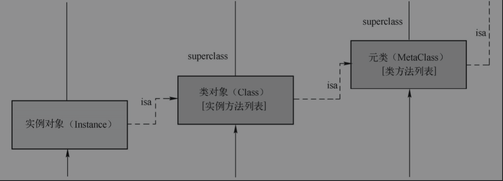

###### 1. 各种属性参数的含义和区别：

**atomic、nonatomic**：原子性和非原子性。原子性是数据库原理里面的一个概念。在多线程中同一个变量可能被多个线程访问甚至更改，进而造成数据污染，因此为了安全，Objective-C中默认是atomic，即会对setter方法加锁，相应的也会付出维护原子性（数据加锁解锁等）的系统资源代价。应用中如果不是特殊情况（多线程间的通信编程），那么一般还是用nonatomic来修饰变量的，不会对setter方法加锁，以提高多线程并发访问时的性能。

**readonly、readwrite**：readonly表示变量只读，也就是它修饰的变量只有get方法而没有set方法；readwrite既有get方法，也有set方法，可读亦可写。

getter=< gettername >，setter=< settername >：可以选择性地在括号里直接指定存取方法的方法名。

**assign**：直接简单赋值，不会增加对象的引用计数，用于修饰非Objective-C类型，主要指基础数据类型（例如NSInteger）和C数据类型（例如int、float、double、char等），或修饰对指针的弱引用。

**weak**：修饰弱引用，不增加引用对象的引用计数，主要可以用于避免循环引用，和strong/retain对应，功能上和assign一样简单，但不同的是用weak修饰的对象消失后会自动将指针置nil，防止出现“悬挂指针”。

**unsafe_unretained**：这种修饰方式不常用，通过名字看出它是不安全的，为什么这么说呢?它和weak类似都是自己创建并持有对象，之后却不会继续被自己持有（引用计数没有+1，引用计数为0的时候会被自动释放，尽管unsafe_unretained和weak修饰的指针还指向那个对象）。不同的是，虽然在ARC中由编译器来自动管理内存，但unsafe_unretained修饰的变量并不会被编译器进行内存管理，也就是说既不是强引用也不是弱引用，生成的对象立刻就被释放掉了，出现了所谓的“悬挂指针”，所以不安全。

**retain**：常用于引用类型，是为了持有对象，声明强引用，将指针本来指向的旧的引用对象释放掉，然后将指针指向新的引用对象，同时将新对象的索引计数加1。

**strong**：原理和retain类似，只不过在使用ARC自动引用计数时，用strong代替retain。

**copy**：建立一个和新对象内容相同且索引计数为1的对象，指针指向这个对象，然后释放指针之前指向的旧对象。NSString变量一般都用copy修饰，因为字符串常用于直接复制，而不是去引用某个字符串。


###### 2. Objective-C中的属性和实例变量有哪些区别?

Objective-C中的属性主要是对传统实例变量的封装，类对象有一个属性列表用来存放类的所有属性。

属性和实例变量的区别主要有以下几个方面的内容：

1. 实例变量的存放采用硬编码，编译后写死，根据距起始地址的偏移量来访问变量，不可再插入新变量，而属性可以在运行时动态添加删除。
2. 实例变量可以通过@private、@public和@protected等修饰词来定义变量的作用域，限制变量的访问权限，而属性不可以。从设计角度，属性主要是用来和外部类进行访问交互的，实例变量主要用于类内部使用。
3. 属性可以通过三类属性特质分别来帮助内存管理、多线程管理和读写控制，可以让编译器自动合成存取方法，而不用重复为每一个实例变量手写存取方法造成代码臃肿。


###### 3.什么时候使用weak关键字?assign和weak有什么区别?

使用weak关键字的几种情况如下：

1. ARC中为了避免出现循环引用，可以让相互引用的对象中的其中一个使用weak（弱引用）。
2. 自定义的IBOutlet控件属性一般也是用weak。

assign和weak的区别主要是weak修饰的指针变量在所指的对象释放时会自动将变量指针置nil，防止指针悬挂，而assign不可以。assign主要用于修饰简单“纯量类型”（scalar type，例如CGFloat或NSlnteger等），进行简单赋值；weak只能用于修饰Objective-C对象，而assign还可以用于修饰非Objective-C对象。


###### 4.ARC下，当不显式指定任何属性关键字时，默认的关键字有哪些?

默认的属性关键字分为两种情况：一种是基本数据类型，另一种是Objective-C普通对象。无论是哪种情况，默认都有atomic原子属性和readwrite可读写属性，而其区别是基本数据类型默认是有一个assign属性关键字，而Objective-C对象对应的默认有一个strong属性关键字。

基本数据类型的默认关键字有atomic、readwrite、assign。普通Objective-C对象的默认关键字有atomic、readwrite、strong。


###### 5. @synthesize和@dynamic各表示什么?有什么区别?

@synthesize修饰的属性默认情况下由系统自动合成setter和getter方法，除非开发者自己定义了这些方法；@synthesize经常用来更改属性的变量名，系统自动合成时默认变量名为_var，即在原变量名前加下画线。

@dynamic用来明确禁止编译器自动合成属性存取方法和默认变量名_var，由程序员自己手动编写存取方法。

对于@synthesize和@dynamic，由于前者明确让编译器自动合成存取方法和默认变量名，而后者明确禁止编译器自动合成存取方法和默认变量名，所以两者语义冲突，不可同时使用。

如果 @synthesize和 @dynamic都没写，那么默认的就是@syntheszie var = _var;


###### 6. 下面这段代码有什么问题?

```
-(void)setAge:(int)newAge{
    self.age = newAge;
}
```

self.age是调用self中变量age的setter方法，setter方法调用自身，即setter方法里面又嵌套调用set方法导致死循环。通过点语法访问变量时，变量为左值时调用的是setter方法，为右值时调用的是getter方法.


###### 7. 在一个对象的方法里面，self.name=@"object";语句和name=@"object";语句有什么区别?

前者是调用setter方法赋值，后者是变量直接赋值。第一种情况的代码等效于：[self setName:@"object];。另外，利用属性让编译器自动合成存取方法时变量名默认加下画线，所以第二种情况直接访问变量时通常为：_name=@"object";。


###### 8.分别写一个setter方法用于完成非ARC下的@property(nonatomic，retain)NSString*name和@property(nonatomic，copy)NSString*name。

第一种情况，retain是指针变量name对新赋值对象的强引用，相当于ARC下的strong，因此对name指针变量set新值时要先将新赋值对象的引用计数加1，然后将指针变量指向新赋值对象，类似于“浅拷贝”。

首先在实现文件中合成属性变量：@synthesisze name;，然后两种情况下自定义setter方法如下，自定义了setter方法后编译器就不会再在编译期重复合成setter方法了。

```
/*retain*/
-(void)setName:(NSString *)newName{
    if(name!=newName){
       [newName retain];
       [name release];
       name = newName;
    }
}
```

第二种情况，copy指当对指针变量name赋值新对象时，是将新对象完全copy一份，将copy好的对象复制给指针变量，即指针指向的是临时copy出来的对象，而不是新赋值的那个对象，因此新赋值对象不需要引用计数加1，因为指针变量并没有指向持有它，类似于“深拷贝”。

```
/*copy*/
-(void)setName:(NSString *)newName{
    if(name!=newName){
        id temp = [newName copy];
        [name release];
        name = temp;
    }
}
```


###### 9.什么是strong“强引用”和weak“弱引用”?它们是怎样帮助控制内存管理和避免内存泄漏的?

从引用计数的角度，强引用会使被引用对象的引用计数加1，而弱引用不会。强引用对象时，要对引用对象进行retain操作（ARC中编译器自动retain），引用结束要释放对象，解除对该对象的强引用。当所有的强引用都解除之后，该对象的引用计数就变为0，对象很快就会被系统销毁掉。

默认的指向对象的指针变量都是strong（强引用），当两个或多个对象互相强引用的时候就可能出现循环引用的情况，也就是引用成了一个强引用环。

例如在ARC自动引用计数机制下，循环引用中的所有对象将永远不会被销毁而导致内存泄漏，因为引用循环使得里面的对象的引用计数至少为1（即使应用中的所有其他对象都释放了对环内的这些对象的拥有权）。因此，对象之间互相的强引用要尽可能避免，使用weak修饰的弱引用就是为了打破循环强引用从而避免内存泄漏的。


###### 10. 类变量的@protected、@private、@public、@package声明各有什么含义?

@protected：表示变量对子类可见，而对于其他类来说变量是私有的，不可访问。

@private：表示变量完全私有化，只对本类可见，其子类也不可访问。

@public：公开变量，表示变量对所有类都是开放可见的，都可以访问。

@package是Objective-C中特有的一个修饰词，一般在开发静态类库的时候会用到，意思是这个关键词修饰的变量对于framework包内部来说是@protected类型的，而对于包外来说是@priviate类型的，这样可以实现包内变量的封装，包内可以使用而包外不可用，防止使用该包的人看到这些变量。


###### 11.什么叫多态?

多态（Polymorphism）在面向对象语言中指同一个接口可以有多种不同的实现方式，Objective-C中的多态则是不同对象对同一消息的不同响应方式，子类通过重写父类的方法来改变同一消息的实现，体现多态性。


###### 12.重载、重写和隐藏的区别是什么?

重载（overload）：函数名相同，函数的参数列表不同（包括参数个数和参数类型），至于返回类型可同可不同。重载发生在同一个类的不同函数之间，是横向的。重载和多态性无关。

重写（override）：主要指父类虚函数（虚函数是C++语言概念）的重写，用来体现多态性，指子类不想继承使用父类的方法，通过重写同一个函数来实现对父类中同一个函数的覆盖，因此又叫函数覆盖。重写的函数必须和父类一模一样，包括函数名、参数个数和类型以及返回值，只是重写了函数的实现。重写发生于父类和子类之间，是纵向的。

隐藏：Objective-C中没有隐藏，典型的C++中有，通过虚函数和父子类之间的函数重写进行区分，此处不再讨论。其中，重载和重写是针对函数的，而隐藏除了函数还会针对成员变量。隐藏发生在父类和子类之间，隐藏指父类的同名函数或变量在子类中隐藏，其中只要函数同名就隐藏，不管参数相同与否。在子类中父类的同名函数或变量不可见，但在父类中依然存在。


###### 13.Objective-C和Swift中有重载吗

Swift中有重载，但Objective-C中基本不支持重载，事实上Objective-C支持参数个数不同的函数重载。


###### 14.Objective-C的类可以多重继承吗?可以实现多个接口吗?重写一个类的方式用继承好还是类别好?为什么?

Objective-C的类只支持单继承，不可以多重继承。

Objective-C可以利用protocol代理协议实现多个接口，通过实现多个接口完成类似C++的多重继承。在Objective-C中多态特性是通过protocol（协议）或者Category（类别）来实现的。protocol定义的接口方法可以被多个类实现，Category可以在不变动原类的情况下进行方法重写或者扩展。

重写一个类一般情况下使用类别更好，因为用Category去重写类的方法，仅对本Category有效，不会影响到其他类与原有类的关系。


###### 15. Cocoa中有虚基类的概念吗?

Cocoa中没有虚基类的概念。虚基类是C++语言中为了解决多重继承二义性问题的，而Objective-C中只有单继承。

要实现类似C++语言中的多继承，可以通过protocal来简单实现，因为一个类可以实现多个协议，类似于Java中一个类可以实现多个接口。


###### 16.Objective-C语言的动态性:

1. 动态类型（Dynamic typing）：运行时确定对象的类型。

   id修饰的对象为动态类型对象，其他在编译器指明类型的为静态类型对象，通常如果不需要涉及多态还是要尽量使用静态类型（原因：错误可以在编译器提前查出，可读性好）。

2. 动态绑定（Dynamic binding）：运行时确定对象的调用方法。

   利用动态类型和动态绑定可以实现动态改变消息的执行者和消息的接收者，另外与动态绑定相关的还有基于消息传递机制的消息转发机制，主要处理应对一些接收者无法处理的消息，此时有机会将消息转发给其他对象处理。

   动态绑定是基于动态类型的，在运行时对象的类型确定后，对象的属性和方法也就确定了，包括类中原来的属性和方法，以及运行时动态新加入的属性和方法。可以通过对象的isa指针找到方法列表，即可执行的消息列表。

3. 动态加载（Dynamic loading）：运行时加载需要的资源或者可执行代码。

   动态加载主要包括两个方面，一个是动态资源加载，另一个是代码模块的加载。这些资源在运行时根据需要有选择性地加入到程序中，是一种代码和资源的“懒加载”模式，可以降低内存开销，提高整个程序的性能，另外也大大提高了可扩展性。


###### 17. 消息传递机制

在Objective-C中，方法的调用不再理解为对象调用其方法，而是要理解成对象接收消息，消息的发送采用“动态绑定”机制，具体会调用哪个方法直到运行时才能确定，确定后才会去执行绑定的代码。方法的调用实际就是告诉对象要干什么，给对象传递一个消息，对象为接收者（receiver），调用的方法及其参数就是消息（message），给一个对象传递消息的表达为：[receiver message];接收者的类型可以通过动态类型识别在运行时确定。

在消息传递机制中，当开发者编写[receiver message];语句发送消息后，编译器都会将其转换成对应的一条objc_msgSend C语言消息发送原语。


###### 18.消息转发机制

如果在消息的传递过程中，接收者无法响应收到的消息，那么会触发进入消息转发机制。消息转发依次提供了3道防线，任何一个起作用都可以挽救此次消息转发。按照先后顺序3道防线依次为：

1. 动态补加方法的实现
2. 直接返回消息转发到的对象（将消息发送给另一个对象去处理）
3. 手动生成方法签名并转发给另一个对象


###### 19.什么是编译时与运行时

编译时：即编译器对语言的编译阶段，编译时只是对语言进行最基本的检查报错，包括词法分析、语法分析等，将程序代码翻译成计算机能够识别的语言（例如汇编等），编译通过并不意味着程序就可以成功运行。

运行时：即程序通过了编译这一关之后编译好的代码被装载到内存中运行起来的阶段，这个时候会对类型进行检查，而不仅仅是对代码的简单扫描分析，此时若出错程序会崩溃。

可以说编译时是一个静态的阶段，类型错误很明显可以直接检查出来，可读性也好；而运行时是动态的阶段，开始具体与运行环境结合起来。


###### 20.对于语句NSString*testObject=[[NSDataalloc] init];，testObject在编译时和运行时分别是什么类型的对象?

testObject是一个指向某个对象的指针，不论何时指针的空间大小都是固定的。

编译时：指针的类型为NSString，即编译时会被当成一个NSString实例来处理，编译器在类型检查的时候，如果发现类型不匹配则会给出黄色警告，由于该语句给指针赋值用的是一个NSData对象，所以编译时会给出类型不匹配警告。但编译时如果testObject调用NSString的方法，那么编译器会认为是正确的，既不会警告也不会报错。

运行时：运行时指针指向的实际是一个NSData对象，因此如果指针调用了NSString的方法，那么虽然编译时通过了，但运行时会崩溃，因为NSData对象没有该方法。另外，虽然运行时指针实际指向的是NSData，但编译时编译器并不知道（前面说了编译器会把指针当成NSString对象处理），因此如果试图用这个指针调用NSData的方法，那么会直接编译不通过，给出红色报错，程序也运行不起来。


###### 21.动态类型识别方法:

1. Class类型

   ```
   //通过类名得到对应的Class动态类型
   Class class = [NSObject class];
   //通过实例对象得到对应的Class动态类型
   Class class = [obj class]
   //判断是不是相同类型的实例
   if([obj1 class] == [obj2 class])
   ```

2. Class动态类型和类名字符串的相互转换

   ```
   //由类名字符串得到Class动态类型
   NSClassFromString(@"NSObject");
   //由类名的动态类型得到类名字符串
   NSStringFromClass([NSObject class]);
   //由对象的动态类型得到类名字符串
   NSStringFromClass([obj class]);
   ```

3. 判断对象是否属于某种动态类型

   ```
   //判断某个对象是否是动态类型Class的实例或其子类的实例
   -(BOOL)isKindOfClass:class
   //与isKindOfClass 不同的是，这里只判断某个对象是否是Class类型的实例，不放宽到其子类
   -(BOOL)isMemberOfClass:class
   ```

4. 判断类中是否有对应的方法

   ```
   //类中是否有这个类方法
   -(BOOL)responsToSelector:(SEL)selector
   //类中是否有这个实例方法
   -(BOOL)instancesResponseToSelector:(SEL)selector
   ```

5. 方法名字符串和SEL类型的转换

   在编译期，编译器会根据方法的名字和参数序列生成唯一标识该方法的ID，这个ID为SEL类型。到了运行时编译器通过SEL类型的ID来查找对应的方法，方法的名字和参数序列相同，那么它们的ID就都是相同的。另外，可以通过@select()指示符获得方法的ID。

   ```
   SEL funcID = @selector(func)
   SEL funcID = NSSelectorFromString(@"func");
   NSString *funcName = NSStringFromSelector(funcID);
   ```


###### 22.  Objective-C中的id类型指的是什么？id、nil代表什么

id表示Objective-C对象的类型在编写代码时（编译期）不确定，视为任意Object类型（即指向任意继承了NSObject的类的对象或者NSObject对象的指针），直到程序运行起来时才最终确定其类型。

id类似于C/C++中的void*，但id和void*并非完全一样。id是一个指向继承了NSObject的Objective-C对象的指针，注意id是一个指针，虽然省略了*号。id和C语言的void*之间需要通过bridge关键字来显式的桥接转换。

Objective-C中的nil定义在objc/objc.h中，表示一个指向空的Objctive-C对象的指针。例如weak修饰的弱引用对象在指向的对象释放时会自动将指针置为nil，即空对象指针，来防止指针悬挂。


###### 23.instancetype和id有什么区别?为什么返回类的实例的类方法或实例方法使用instancetype而不是id?

instancetype和id都可以用来代表任意类型，将对象类型的确定往后推迟，用于体现Objective-C语言的动态性，使其声明的对象具有运行时的特性。

它们的区别是：instancetype只能作为返回值类型，但在编译期instancetype会进行类型检测，因此对于所有返回类的实例的类方法或实例方法，建议返回值类型全部使用instancetype而不是id；id类型既可以作为返回值类型，也可以作为参数类型，也可以作为变量的类型，但id类型在编译期不会进行类型检测。


###### 24. id，NSObject，id<NSObject>的区别是什么?

NSObject修饰的对象肯定是NSObject对象，但id修饰的对象虽然肯定是Objective-C对象，但不一定是NSObject对象，id类型是一种运行时的动态类型，编译器不会对其进行类型检查。id<NSObject>修饰的对象也是一种动态类型对象，对象的类型在运行时才确定，但编译器知道它一定是遵守NSObject协议的。例如：id<NSObject>常用来定义delegate对象。


###### 25. 一般的方法method和Objective-C中的选择器selector有什么区别

selector是一个方法的名字，基于动态绑定环境下；method是一个组合体，包含了名字和实现。

可以理解@selector()就是取类方法的编号，它的行为基本可以等同C语言的中函数指针，只不过C语言中，可以把函数名直接赋给一个函数指针，而Objective-C的类不能直接应用函数指针，只能通过一个@selector语法来取，它的结果是一个SEL类型。这个类型本质是类方法的编号(函数地址)。


###### 26.什么时候会报unrecognized selector错误

unrecognized selector错误主要发生在消息接收者无法正确响应发来的消息时，即无法找到消息对应的实现时。

unrecognized selector错误指无法识别的selector，即receiver无法处理发出的消息。根据消息传递机制和动态绑定机制可知，向接收者对象发送消息后，会根据其isa指针到其类对象的方法列表中以方法名为键找对应的方法实现，如果找不到，那么启动消息转发机制，但如果消息转发机制仍然无法弥补，那么就意味着接收者无法响应以及正确处理该消息，就会报unrecognizedselector错误导致程序崩溃。


###### 27. 什么是目标-动作机制

目标-动作（target-action）机制是一种设计模式，用于一个对象在某个事件发生时向另一个对象发送消息。消息中要包含一个selector，用于确定要触发的方法，该方法即该机制中的动作。还要包含一个target（目标），表示消息的接收者，例如一个控件，或者更为常见的是它的单元，以插座变量的形式保有其动作消息的目标。

典型的例子是UIButton的单击事件和方法的绑定，当按钮事件发生时，会触发接收者对于该事件所绑定的方法。这里的UIButton按钮即MVC中的V组件，通过目标-动作机制绑定的selector方法即属于C中的后续逻辑处理部分。


###### 28.在runtime中类与对象如何表示

在runtime库中，对象是用C语言中的结构体表示，而方法用C语言中的函数来实现，另外也加入了一些额外的特性。这些结构体和函数被Runtime函数封装后，开发者就可以利用运行时特性在程序运行阶段动态地创建、查看、修改类、对象和它们的方法。

在runtime中，Objective-C中的类是由Class类型来表示的，通过objc/objc.h可以查看到Class类型实际上是指向objc_class结构的指针。

objc_class结构体的定义如下：

```
struct objc_class {
     Class _Nonnull isa OBJC_ISA_AVAILABILITY;
     
     #if!__OBJC2__
       Class _Nullable super_class OBJC2_UNAVAILABLE;
       const char * _Nonnull name  OBJC2_UNAVAILABLE;
       long version OBJC2_UNAVAILABLE;
       long info OBJC2_UNAVAILABLE;
       long instance_size OBJC2_UNAVAILABLE;
       struct objc_ivar_list * _Nullable ivars  OBJC2_UNAVAILABLE;
       struct objc_method_list * _Nullable * _Nullable methodLists OBJC2_UNAVAILABLE;
      struct objc_cache * _Nonnull cache   OBJC2_UNAVAILABLE;
      struct objc_protocol_list * _Nullable protocols OBJC2_UNAVAILABLE;
    #endif
} OBJC2_UNAVAILABLE;
   
```

* isa：在Objective-C中，所有的类自身也是一个对象，这个对象的Class里面也存在一个isa指针。对象需要通过isa指针找到它的类，类需要通过isa找到它的元类（Meta Class）。元类可以理解为类对象的类，每个类都会有一个单独的元类。事实上，元类也是一个类，它也存在isa指针，它的isa指针指向父类的元类。也就是说，任何NSObject继承体系下的元类都使用NSObject的元类作为自己的所属类，而基类的元类的isa指针是指向它自己。这样就形成了一个完美的闭环。isa指针在调用实例方法和类方法的时候会起到重要的作用。
* super_class：指向该类的父类，如果该类已经是最顶层的类（Root Class），那么super_class就是nil。
* cache：它主要用于缓存类中最近使用的方法。当开发者调用过一个方法后，runtime会将这个方法缓存到cache列表中，如果再次调用这个方法，那么runtime就会优先去cache中查找，如果cache没有，那么就会去methodLists中查找该方法。这样就大大提高了调用方法的效率。
* ivars：指向该类的成员变量链表。
* methodLists：指向方法定义的链表。
* protocols：指向协议链表。


在objc_object结构体中只有一个字段，即指向其类的isa指针。通过这个指针，runtime会找到这个实例对象所属的类。当创建一个特定类的实例对象时，分配的内存包含一个objc_object数据结构，然后是类的实例变量的数据。


###### 29. 如何使用runtime动态添加一个类


###### 30. 如何理解消息传递机制

对Objective-C对象调用方法的操作通常称为“消息传递”。在Objective-C中，如果向某对象传递消息，那么就会使用动态绑定机制来决定需要调用的方法。在底层，所有方法都是普通的C语言函数，然而对象收到消息之后，究竟该调用哪个方法则完全由runtime来决定，有时甚至可以在运行期改变方法的实现。

消息的接收者（receiver）和参数（parameter）合起来称为“消息”（message）。在编译阶段，会将上面的代码转换成C语言函数调用，所调用的函数是消息传递机制中的核心函数，叫作objc_megSend.

objc_msgSend函数将消息接收者和方法名作为其基础参数。其中，参数self代表消息接收者，参数SEL代表方法名（selector，又称选择器）。每个类中的方法列表（methodLists）类似于一张表格，其中的指针都会指向方法的实现，而方法名是查表时所用的键。objc_msg Send函数正是通过这张表格来寻找应该执行的方法并跳转至其实现的。objc_msgSend函数会根据接收者和方法来调用适当的方法。基本流程如下：

1.objc_msgSend函数通过isa指针在接收者所属的类中搜寻方法缓存列表（cache）和方法列表，如果能找到与方法名相符合的方法，那么就跳转至其实现代码。

2.若是找不到，那么就会通过super_class指针沿着类的继承体系继续向上查找，如果能够找到合适的方法，那么就会跳转。

3.如果上面两步都无法找到相符的方法，那么就会执行消息转发（message forwarding）机制。


###### 31.SEL

SEL又称选择器，表示的是一个方法的selector的指针。

Objective-C在编译时，会根据每个方法的名字、参数列表，生成一个唯一的整型标识，这个标识就是SEL。正因为其具有唯一性，所以在Objective-C的同一个类中，不能存在两个同名的方法，即使参数类型不同也不行。

开发者可以在运行时添加新的selector，也可以在运行时获取已存在的selector。

工程中所有的SEL会组成一个Set集合，Set的特点就是具有唯一性，因此SEL也是唯一的。如果想要查找某个方法，那么只需要找到这个方法所对应的SEL就可以了，SEL实际上就是根据方法名Hash转换的一个字符串。


###### 32.IMP

IMP实际上也是个函数指针，它指向方法实现的首地址，可以把它理解为方法的具体实现。

通过SEL指针查找方法，实际上就是查找方法的IMP。由于每个方法对应唯一的SEL，所以可以通过SEL方便快速准确地获取它所对应的IMP。取得IMP之后，就可以像调用普通的C语言函数一样来使用这个函数指针了。

结构体objc_method包含了一个SEL和IMP，实际上它相当于在SEL和IMP之间作了一个映射。


###### 33.isKindOfClass和isMemberOfClass有什么区别与联系

isKindOfClass和isMemberOfClass都是Objective-C语言的内省特性方法，用于实现动态类型识别（判断某个对象是否属于某个动态类型）。

isKindOfClass的判“真”要求相对宽松，它是判断某个对象是否是Class类型的实例或其子类的实例。

isMemberOfClass的判“真”要求相对更高，比isKindOfClass严格的是，isMemberOfClass只判断某个对象是否是Class类型的实例，不放宽到其子类。


###### 34. Objective-C有私有方法吗？有私有变量吗

表面上看，Objective-C中是可以实现私有的变量和方法的，即将它们隐藏不暴露在头文件中，不可以显式地直接访问，但是Objective-C中这种私有并不是绝对的私有，例如即使将变量和方法隐藏在.m实现文件中，开发者仍然可以利用KVC或runtime运行时机制强行访问没有暴露在头文件的变量或方法。

Objective-C中实现变量和方法“私有”的方式主要有两种。

1.在类的头文件中声明私有变量。

2.在.m实现文件头部的类扩展区域定义私有属性或方法，其中方法可不用声明，直接在实现文件中实现即可，只要不在头文件声明的方法都对外不可见。


暴力访问对象私有方法：

KVC访问变量不受私有权限的限制。

运行时可以使用class_copyIvarList函数获取类对象的Ivar变量列表，然后可使用object_getIvar和object_setIvar运行时函数对变量进行暴力访问。

Runtime暴力访问对象私有方法：和访问私有变量类似，这里使用class_copyMethodList运行时函数获取类对象中的方法列表，然后使用performSelector函数执行某个方法。


###### 35.Objective-C中的类别与扩展机制

类别是Objective-C语言中的一个灵活的类扩展机制，用于在不获悉、不改变原来代码的情况下往一个已经存在的类中添加新的方法，只需要知道这个类的公开接口，而不需要知道类的源代码。类别只能为已存在的类添加新的功能扩展方法，而不能添加新的属性。类别扩展的新方法有更高的优先级，会覆盖类中同名的已有方法。类别的设计体现了面向对象的核心原则，即开放封闭原则（Open Closed Principle，OCP）。对扩展开放，对修改封闭，从而降低代码的耦合度。

类别（Category）与继承（Inheritance）的区别如下：

1.子类继承是进行类扩展的另一种常用方法，当然基于子类继承的扩展更加自由、正式，既可以新增属性，也可以新增方法。类别可以在不获悉、不改变原来代码的情况下往里面添加新的方法，但也只能添加方法，不能添加属性，属于功能上的扩展。类别扩展的优点是不需要创建一个新的类，而是在系统中已有的类上直接扩展、覆写，不需要更改类就可以添加并使用扩展方法。

2.相对于子类继承扩展，类别的另一明显优势就是实现了功能的局部化封装，扩展的功能只会在本类被引用时看到。


类别与类扩展的区别如下：类别和类扩展的明显区别在于，类扩展可以添加属性。另外，类扩展添加的方法是必须要实现的。类扩展可以认为是一个私有的匿名的类别，因为类扩展定义在.m文件头部，添加的属性和方法都没有暴露在头文件，所以在不考虑运行时特性的前提下这些扩展属性和方法只能在类内部使用，一定程度上可以说是实现了私有的机制。


###### 36.Objective-C中类别特性的作用及其局限性是什么

Objective-C中类别特性的作用如下：

1.可以将类的实现分散到多个不同文件或多个不同框架中（扩充新的方法）。

2.可以创建对私有方法的前向引用。

3.可以向对象添加非正式协议。


Objective-C中类别特性的局限性如下：

1.类别只能向原类中添加新的方法，且只能添加而不能删除或修改原方法，不能向原类中添加新的属性。

2.类别向原类中添加的方法是全局有效的而且优先级最高，如果和原类的方法重名，那么会无条件覆盖掉原来的方法，造成难以发现的潜在危险。因此，使用类别添加方法一定注意保证是单纯的添加新方法，避免覆盖原来的方法（可以通过添加该类别的方法前缀来防止冲突）。


###### 37.为什么类别只能添加扩展方法而不能添加属性变量

在类别中扩展属性不能成功的原因是无法在类别中取得属性的加下画线的实例变量名，导致无法手动实现实例变量的存取方法。在类别中定义了属性后，属性其实也成功添加到了类的属性列表中，但编译器只为其声明了存取方法，没有实现，同时又没有合成加下画线的实例变量名，导致无法访问实例变量也无法自己手动实现其存取方法，对于一个不能访问的属性，则失去了其存在的意义。

如果使用运行时的机制，那么开发者其实可以强行实现类别中属性的存取方法，实现在类别中扩展属性。


###### 38.Method Swizzling魔法

Objective-C的运行时特性提供了一种称作Method Swizzling的方法利器，利用它可以更加随心所欲地在运行时期间对编译器已经实现的方法再次动手脚，主要包括：交换类中某两个方法的实现、重新添加或替换某个方法的具体实现。

Method Swizzling主要用于在运行时对编译器编译好的方法再次进行编辑，应用场景主要有以下4种。

1.替换类中某两个类方法或实例方法的实现

替换函数：method_exchangeImplementations(method1,method2)。

2.重新设置类中某个方法的实现设置函数：method_setImplementation(method,IMP)
3.替换类中某个方法的实现替换方法实现函数：class_replaceMethod(Class cls,SELname,IMP imp,const char*types)。

4.在运行时为类添加新的方法添加函数：class_addMethod()。


###### 39.如何使用runtime进行方法交换

runtime中的Method Swizzling被称为黑魔法，它可以将两个方法的实现交换。


###### 40.一个Objective-C对象的isa指针指向什么?有什么作用?

Objective-C实例对象的isa指针是指向它的类对象的。Objective-C中有3个层次的对象：实例对象（Instance）、类对象（Class）和元类（MetaClass）。Class即自定义的类，是实例对象的类对象，而类对象又是其对应元类的实例对象。它们的关系如图所示。




isa指针的作用是通过它可以找到对应类对象或元类中的方法（对象可接收的方法列表）。


###### 41. 循环引用

循环引用的实质：多个对象相互之间有强引用，不能释放让系统回收。

如何解决循环引用？

1、避免产生循环引用，通常是将 strong 引用改为 weak 引用。 比如在修饰属性时用weak 在block内调用对象方法时，使用其弱引用，这里可以使用两个宏

\#define WS(weakSelf) __weak __typeof(&*self)weakSelf = self; // 弱引用

\#define ST(strongSelf) __strong __typeof(&*self)strongSelf = weakSelf; //使用这个要先声明weakSelf 还可以使用__block来修饰变量 在MRC下，__block不会增加其引用计数，避免了循环引用 在ARC下，__block修饰对象会被强引用，无法避免循环引用，需要手动解除。

2、在合适时机去手动断开循环引用。 通常我们使用第一种。

- 代理(delegate)循环引用属于相互循环引用

  delegate 是iOS中开发中比较常遇到的循环引用，一般在声明delegate的时候都要使用弱引用 weak,或者assign,当然怎么选择使用assign还是weak，MRC的话只能用assign，在ARC的情况下最好使用weak，因为weak修饰的变量在释放后自动指向nil，防止野指针存在

- NSTimer循环引用属于相互循环使用

  在控制器内，创建NSTimer作为其属性，由于定时器创建后也会强引用该控制器对象，那么该对象和定时器就相互循环引用了。 如何解决呢？ 这里我们可以使用手动断开循环引用： 如果是不重复定时器，在回调方法里将定时器invalidate并置为nil即可。 如果是重复定时器，在合适的位置将其invalidate并置为nil即可

3、block循环引用

由于block会对block中的对象进行持有操作,就相当于持有了其中的对象，而如果此时block中的对象又持有了该block，则会造成循环引用。 解决方案就是使用__weak修饰self即可

并不是所有block都会造成循环引用。 只有被强引用了的block才会产生循环引用 而比如dispatch_async(dispatch_get_main_queue(), ^{}),[UIView animateWithDuration:1 animations:^{}]这些系统方法等 或者block并不是其属性而是临时变量,即栈block

还有一种场景，在block执行开始时self对象还未被释放，而执行过程中，self被释放了，由于是用weak修饰的，那么weakSelf也被释放了，此时在block里访问weakSelf时，就可能会发生错误(向nil对象发消息并不会崩溃，但也没任何效果)。 对于这种场景，应该在block中对 对象使用__strong修饰，使得在block期间对 对象持有，block执行结束后，解除其持有。


###### 42. block和delegate的区别

* delegate运行成本低，block的运行成本高

  block出栈需要将使用的数据从栈内存拷贝到堆内存，当然对象的话就是加计数，使用完或者block置nil后才消除。delegate只是保存了一个对象指针，直接回调，没有额外消耗。就像C的函数指针，只多做了一个查表动作。

* delegate更适用于多个回调方法（3个以上），block则适用于1，2个回调时。


###### 43. runtime具体应用

* 利用关联对象（AssociatedObject）给分类添加属性
* 遍历类的所有成员变量（修改textfield的占位文字颜色、字典转模型、自动归档解档）
* 交换方法实现（交换系统的方法）
* 利用消息转发机制解决方法找不到的异常问题
* KVC 字典转模型