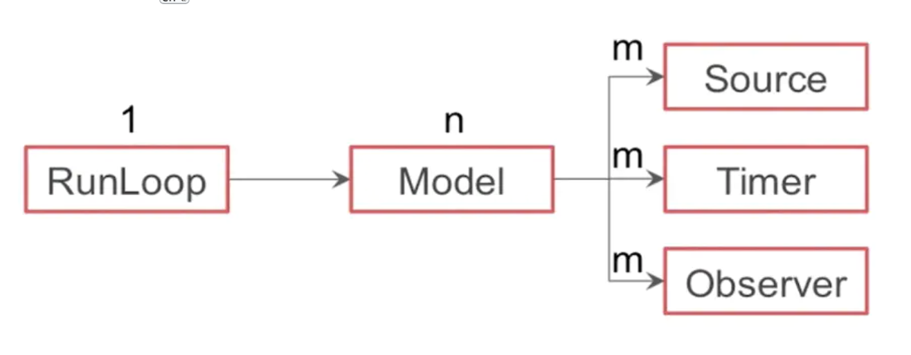
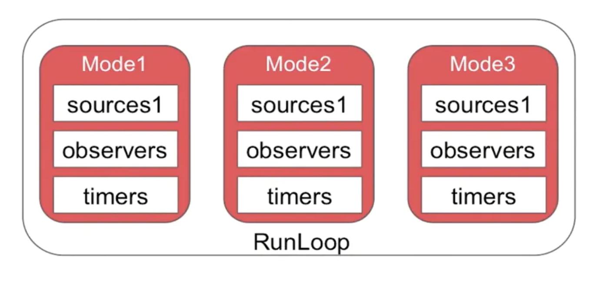
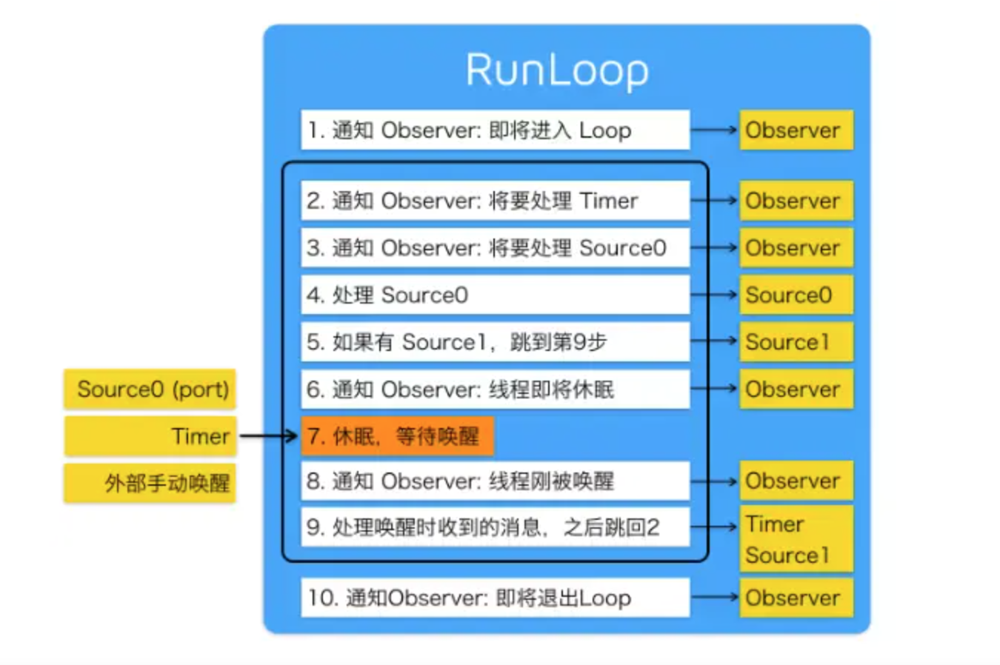
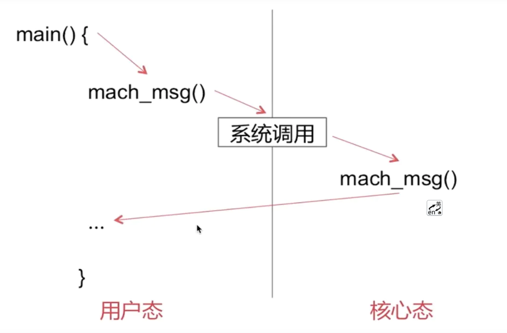

#### RunLoop剖析

#### 一、RunLoop概念

**RunLoop是通过内部维护的`事件循环(Event Loop)`来对`事件/消息进行管理`的一个对象。**

1. 没有消息处理时，休眠以避免资源占用，由用户态切换到内核态([CPU-内核态和用户态](https://www.jianshu.com/p/3bb1cdd44ef0))
2. 有消息需要处理时，立刻被唤醒，由内核态切换到用户态

**为什么main函数不会退出？**

```
int main(int argc, char * argv[]) {
    @autoreleasepool {
        return UIApplicationMain(argc, argv, nil, NSStringFromClass([AppDelegate class]));
    }
}
```

UIApplicationMain内部默认开启了主线程的RunLoop，并执行了一段无限循环的代码（不是简单的for循环或while循环）

```
//无限循环代码模式(伪代码)
int main(int argc, char * argv[]) {        
    BOOL running = YES;
    do {
        // 执行各种任务，处理各种事件
        // ......
    } while (running);

    return 0;
}
```

UIApplicationMain函数一直没有返回，而是不断地接收处理消息以及等待休眠，所以运行程序之后会保持持续运行状态。


#### 二、RunLoop的数据结构

`NSRunLoop(Foundation)`是`CFRunLoop(CoreFoundation)`的封装，提供了面向对象的API
RunLoop 相关的主要涉及五个类：

* `CFRunLoop`：RunLoop对象
* `CFRunLoopMode`：运行模式
* `CFRunLoopSource`：输入源/事件源
* `CFRunLoopTimer`：定时源
* `CFRunLoopObserver`：观察者


**1、CFRunLoop**

由`pthread`(线程对象，说明RunLoop和线程是一一对应的)、`currentMode`(当前所处的运行模式)、`modes`(多个运行模式的集合)、`commonModes`(模式名称字符串集合)、`commonModelItems`(Observer,Timer,Source集合)构成

**2、CFRunLoopMode**

由name、source0、source1、observers、timers构成

**3、CFRunLoopSource**

分为source0和source1两种

* source0:

  即非基于port的，也就是用户触发的事件。需要手动唤醒线程，将当前线程从内核态切换到用户态

* source1:

  基于port的，包含一个 mach_port 和一个回调，可监听系统端口和通过内核和其他线程发送的消息，能主动唤醒RunLoop，接收分发系统事件。
  具备唤醒线程的能力

**4、CFRunLoopTimer**

基于时间的触发器，基本上说的就是NSTimer。在预设的时间点唤醒RunLoop执行回调。因为它是基于RunLoop的，因此它不是实时的（就是NSTimer 是不准确的。 因为RunLoop只负责分发源的消息。如果线程当前正在处理繁重的任务，就有可能导致Timer本次延时，或者少执行一次）。

**5、CFRunLoopObserver**

监听以下时间点:`CFRunLoopActivity`

* **kCFRunLoopEntry**: RunLoop准备启动
* **kCFRunLoopBeforeTimers**: RunLoop将要处理一些Timer相关事件
* **kCFRunLoopBeforeSources**:RunLoop将要处理一些Source事件
* **kCFRunLoopBeforeWaiting**:RunLoop将要进行休眠状态,即将由用户态切换到内核态
* **kCFRunLoopAfterWaiting**: RunLoop被唤醒，即从内核态切换到用户态后
* **kCFRunLoopExit**:RunLoop退出
* **kCFRunLoopAllActivities**:监听所有状态


**6、各数据结构之间的联系**

线程和RunLoop一一对应， RunLoop和Mode是一对多的，Mode和source、timer、observer也是一对多的




#### 三、RunLoop的mode

关于Mode首先要知道一个RunLoop 对象中可能包含多个Mode，且每次调用 RunLoop 的主函数时，只能指定其中一个 Mode(CurrentMode)。切换 Mode，需要重新指定一个 Mode 。主要是为了分隔开不同的 Source、Timer、Observer，让它们之间互不影响。



当RunLoop运行在Mode1上时，是无法接受处理Mode2或Mode3上的Source、Timer、Observer事件的。

总共是有五种`CFRunLoopMode`:

* `kCFRunLoopDefaultMode`：默认模式，主线程是在这个运行模式下运行
* `UITrackingRunLoopMode`：跟踪用户交互事件（用于 ScrollView 追踪触摸滑动，保证界面滑动时不受其他Mode影响）
* `UIInitializationRunLoopMode`：在刚启动App时第进入的第一个 Mode，启动完成后就不再使用
* `GSEventReceiveRunLoopMode`：接受系统内部事件，通常用不到
* `kCFRunLoopCommonModes`：伪模式，不是一种真正的运行模式，是同步Source/Timer/Observer到多个Mode中的一种解决方案


#### 四、RunLoop的实现机制



这张图在网上流传比较广。
 对于RunLoop而言最核心的事情就是保证线程在没有消息的时候休眠，在有消息时唤醒，以提高程序性能。RunLoop这个机制是依靠系统内核来完成的（苹果操作系统核心组件Darwin中的Mach）。



RunLoop通过`mach_msg()`函数接收、发送消息。它的本质是调用函数`mach_msg_trap()`，相当于是一个系统调用，会触发内核状态切换。在用户态调用 `mach_msg_trap()`时会切换到内核态；内核态中内核实现的`mach_msg()`函数会完成实际的工作。
 即基于port的source1，监听端口，端口有消息就会触发回调；而source0，要手动标记为待处理和手动唤醒RunLoop

[Mach消息发送机制](https://www.jianshu.com/p/a764aad31847)

大致逻辑为：

1. 通知观察者 RunLoop 即将启动。
2. 通知观察者即将要处理Timer事件。
3. 通知观察者即将要处理source0事件。
4. 处理source0事件。
5. 如果基于端口的源(Source1)准备好并处于等待状态，进入步骤9。
6. 通知观察者线程即将进入休眠状态。
7. 将线程置于休眠状态，由用户态切换到内核态，直到下面的任一事件发生才唤醒线程。
   * 一个基于 port 的Source1 的事件(图里应该是source0)。
   * 一个 Timer 到时间了。
   * RunLoop 自身的超时时间到了。
   * 被其他调用者手动唤醒。
8. 通知观察者线程将被唤醒。
9. 处理唤醒时收到的事件。
   * 如果用户定义的定时器启动，处理定时器事件并重启RunLoop。进入步骤2。
   * 如果输入源启动，传递相应的消息。
   * 如果RunLoop被显示唤醒而且时间还没超时，重启RunLoop。进入步骤2
10. 通知观察者RunLoop结束。


#### 五、RunLoop与NSTimer

一个比较常见的问题：滑动tableView时，定时器还会生效吗？
 默认情况下RunLoop运行在`kCFRunLoopDefaultMode`下，而当滑动tableView时，RunLoop切换到`UITrackingRunLoopMode`，而Timer是在`kCFRunLoopDefaultMode`下的，就无法接受处理Timer的事件。
 怎么去解决这个问题呢？把Timer添加到`UITrackingRunLoopMode`上并不能解决问题，因为这样在默认情况下就无法接受定时器事件了。
 所以我们需要把Timer同时添加到`UITrackingRunLoopMode`和`kCFRunLoopDefaultMode`上。
 那么如何把timer同时添加到多个mode上呢？就要用到`NSRunLoopCommonModes`了

```
[[NSRunLoop currentRunLoop] addTimer:timer forMode:NSRunLoopCommonModes];
```

Timer就被添加到多个mode上，这样即使RunLoop由`kCFRunLoopDefaultMode`切换到`UITrackingRunLoopMode`下，也不会影响接收Timer事件


#### 六、RunLoop和线程

* 线程和RunLoop是一一对应的,其映射关系是保存在一个全局的 Dictionary 里
* 自己创建的线程默认是没有开启RunLoop的


**1、怎么创建一个常驻线程？**

* 为当前线程开启一个RunLoop（第一次调用 [NSRunLoop currentRunLoop]方法时实际是会先去创建一个RunLoop）
* 向当前RunLoop中添加一个Port/Source等维持RunLoop的事件循环（如果RunLoop的mode中一个item都没有，RunLoop会退出）
* 启动该RunLoop

```
@autoreleasepool {
        NSRunLoop *runLoop = [NSRunLoop currentRunLoop];
        [[NSRunLoop currentRunLoop] addPort:[NSMachPort port] forMode:NSDefaultRunLoopMode];
        [runLoop run];
    }
```


**2、输出下边代码的执行顺序**

```
NSLog(@"1");
dispatch_async(dispatch_get_global_queue(0, 0), ^{
    NSLog(@"2");
    [self performSelector:@selector(test) withObject:nil afterDelay:10];
    NSLog(@"3");
});
NSLog(@"4");

- (void)test
{
    NSLog(@"5");
}
```


 答案是1423，test方法并不会执行。
 原因是如果是带afterDelay的延时函数，会在内部创建一个 NSTimer，然后添加到当前线程的 RunLoop中。也就是如果当前线程没有开启RunLoop，该方法会失效。
 那么我们改成:

```
dispatch_async(dispatch_get_global_queue(0, 0), ^{
        NSLog(@"2");
        [[NSRunLoop currentRunLoop] run];
        [self performSelector:@selector(test) withObject:nil afterDelay:10];
        NSLog(@"3");
    });
```

然而test方法依然不执行。
 原因是如果RunLoop的mode中一个item都没有，RunLoop会退出。即在调用RunLoop的run方法后，由于其mode中没有添加任何item去维持RunLoop的时间循环，RunLoop随即还是会退出。
 所以我们自己启动RunLoop，一定要在添加item后

```
dispatch_async(dispatch_get_global_queue(0, 0), ^{
        NSLog(@"2");
        [self performSelector:@selector(test) withObject:nil afterDelay:10];
        [[NSRunLoop currentRunLoop] run];
        NSLog(@"3");
    });
```


**3、怎样保证子线程数据回来更新UI的时候不打断用户的滑动操作？**

当我们在子请求数据的同时滑动浏览当前页面，如果数据请求成功要切回主线程更新UI，那么就会影响当前正在滑动的体验。
 我们就可以将更新UI事件放在主线程的`NSDefaultRunLoopMode`上执行即可，这样就会等用户不再滑动页面，主线程RunLoop由`UITrackingRunLoopMode`切换到`NSDefaultRunLoopMode`时再去更新UI

```
[self performSelectorOnMainThread:@selector(reloadData) withObject:nil waitUntilDone:NO modes:@[NSDefaultRunLoopMode]];
```

