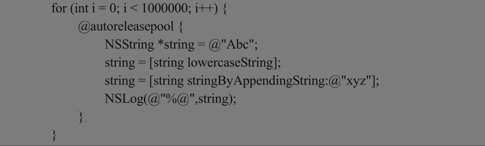

###### 1. 什么是内存泄漏？什么是安全释放

内存泄漏指动态分配内存的对象在使用完后没有被系统回收内存，导致该对象始终占用内存，又无法通过代码访问，属于内存管理出错，如果出现大量内存泄漏，那么会导致系统内存不足的问题。

安全释放指释放掉不再使用的对象的同时不会造成内存泄漏或指针悬挂问题的操作。为了保证安全释放，在对象dealloc后要将其指针置为nil。另外，要严格遵守内存管理原则，保证对象的引用计数正确，同时要注意避免引用循环的出现。


###### 2. 僵尸对象、野指针、空指针分别指什么？它们有什么区别

1. 僵尸对象

   一个引用计数为0的Objective-C对象被释放后就变成僵尸对象。僵尸对象的内存已经被系统回收，虽然该对象可能还存在，数据依然在内存中，但僵尸对象已经是不稳定对象了，不可以再访问或者使用，它的内存是随时可能被别的对象申请而占用的。需要注意的是，僵尸对象所占的内存是正常的，不会造成内存泄漏。

2. 野指针

   野指针又叫“悬挂指针”，野指针出现的原因是指针没有赋值，或者指针指向的对象已经被释放掉了。野指针指向一块随机的垃圾内存，向它们发送消息会报EXC_BAD_ACCESS错误导致程序崩溃。

3. 空指针

   空指针不同于野指针，它是一个没有指向任何内容的指针。空指针是有效指针，值为nil、NULL、Nil或0等，给空指针发送消息不会报错，只是不响应消息而已，应该给野指针及时赋予零值使其变成有效的空指针，避免内存报错。


###### 3.Objective-C有GC垃圾回收机制吗

Objective-C语言本身是支持垃圾回收机制的，但有平台局限性，仅限于Mac桌面系统开发中，而在iPhone和iPad等苹果移动终端设备中是不支持垃圾回收机制的。

在移动设备开发中的内存管理是采用手动引用计数（Manual Reference Counting，MRC）以及iOS5以后的自动引用计数（Automatic ReferenceCounting，ARC），本质都是引用计数（RC），通过引用计数的方式来管理内存的分配与释放，从而防止内存泄漏。


###### 4. 自动释放池跟GC（垃圾回收）有什么区别?iPhone上有GC吗?[pool release]和[pool drain]有什么区别?

[pool release]和[pool drain]在作用上是一样的，它们都是清理自动释放池，区别是drain在支持GC的系统中（Mac系统）可以引起GC回收操作，而release不可以。对于自动释放池一般建议使用[pool drain]，原因是它的功能对系统兼容性更强，二者也是为了跟普通对象的release释放区别开。自动释放池的释放操作指向池内所有的对象发送release消息，以让系统及时释放池内的所有对象。


###### 5. 在Objective-C中，与alloc语义相反的方法是dealloc还是release

alloc与dealloc语意相反，alloc是创建变量，dealloc是释放变量。

retain与release语义相反，retain保留一个对象，调用后使变量的引用计数加1，而release释放一个对象，调用后使变量的引用计数减1。

虽然alloc对应dealloc，retain对应release，但是与alloc配对使用的方法是release，而不是dealloc。

alloc用来创建对象，刚创建的对象默认引用计数为1，相当于调用alloc创建对象过程中同时会调用一次retain使对象引用计数加1，自然要有对应的release的一次调用，使对象不再被用时能够被释放掉防止内存泄漏。

dealloc是在对象引用计数为0以后系统自动调用的，dealloc没有使对象引用计数减1的作用，只是在对象引用计数为0后被系统调用进行内存回收的收尾工作。


###### 6. 当使用block时，什么情况会发生引用循环？如何解决

常见的使用block引起引用循环的情况为：在一个对象中强引用了一个block，在该block中又强引用了该对象，此时就出现了该对象和该block的循环引用。

解决引用循环的方法有以下两种：一是强制将一方置nil，破坏引用循环；二是将对象使用__weak或者__block修饰符修饰之后再在block中使用。


###### 7.CAAnimation的delegate是强引用还是弱引用

CAAnimation的delegate（代理）是强引用，是内存管理中一个罕见的特例。为了避免循环引用问题，delegate通常都使用assign或weak修饰表示弱引用，而CAAnimation动画是异步的，如果动画的代理是弱应用而不是强应用，那么会导致其随时都可能被释放掉。在使用动画时要注意采取措施避免循环引用，例如及时在视图移除之前的合适时机移除动画。


###### 8.按照默认法则，哪些关键字生成的对象需要手动释放

起初在MRC（手动引用计数）中开发者要自己手动管理内存，基本原则是：谁创建，谁释放，谁引用，谁管理。其中，创建主要始于关键词new、alloc和copy的使用，创建并持有开始引用计数为1，如果引用要通过发送retain消息增加引用计数，通过发送release消息减少引用计数，那么引用计数变为0后对象会被系统清理释放。现在有了ARC（自动引用计数）后编译器会自动管理引用计数，开发者不再需也不可以手动管理引用计数。

使用new、alloc、copy关键字生成的对象和retain了的对象需要手动释放。被设置为autorelease的对象不需要手动释放，会直接进入自动释放池。


###### 9.对于引用计数可以总结如下：

1. 使对象引用计数加1的常见操作有alloc、copy、retain。
2. 使对象引用计数减1的常见操作有release、autorealease。
3. 自动释放池是一个统一来释放一组对象的容器，在向对象发送autorelease消息时，对象并没有立即释放，而是将对象加入到最新的自动释放池（即将该对象的引用交给自动释放池，之后统一调用release），自动释放池会在程序执行到作用域结束的位置时进行drain释放操作，这个时候会对池中的每一个对象都发送release消息来释放所有对象。这样其实就实现了这些对象的延迟释放。
4. 自动释放池释放的时机指自动释放池内的所有对象是在什么时候释放的，这里要提到程序的运行周期RunLoop。对于每一个新的RunLoop，系统都会隐式地创建一个autorelease pool，RunLoop结束时自动释放池便会进行对象释放操作。autorelease和release的区别主要是引用计数减1的时机不同，autorelease是在对象的使用真正结束的时候才做引用计数减1，而不是收到消息立马释放。


###### 10. 执行下面的代码会发生什么后果?

```
Ball *ball = [[[[Ball alloc] init] autorelease] autorelease];
```

上面的代码会导致程序崩溃，因为连续两次调用autorelease方法后，对象被加入到自动释放池两次。当对象被移除时，自动释放池将其释放了不止一次，其中第二次释放必定导致崩溃。


###### 11. 下面这段代码有什么问题?如何修改?


代码通过循环短时间内创建了大量的NSString对象，在默认的自动释放池释放之前这些对象无法被立即释放，会占用大量内存，造成内存高峰以致内存不足。

为了防止大量对象堆积应该在循环内手动添加自动释放池，这样在每一次循环结束，循环内的自动释放池都会被自动释放及时腾出内存，从而大大缩短了循环内对象的生命周期，避免内存占用高峰。

代码改进方法是在循环内部嵌套一个自动释放池：




###### 12. MRC中通过调用静态方法创建的新对象，不再使用时需要对其发送release消息吗?

不需要再发送release消息，因为约定静态方法创建的对象会自动将其放入自动释放池，即已对其发送autorelease消息，所以不可再对其进行手动释放。


###### 13. 如果一个对象释放前被加到了NotificationCenter中，不在NotificationCenter中，那么remove对象可能会怎样

对于NotificationCenter的使用，只要添加对象到消息中心进行通知注册，之后就一定要对其remove进行通知注销。将对象添加到消息中心后，消息中心只是保存该对象的地址，消息中心到时候会根据地址发送通知给该对象，但并没有取得该对象的强引用，对象的引用计数不会加1。如果对象释放后没有从消息中心remove，也就是通知中心还保存着那个指针，而那个指针指的对象可能已经被释放销毁了，那么那个指针就成为一个野指针，当通知发生时，会向这个野指针发送消息导致程序崩溃。


###### 14. NSArray和NSMutableArray在Copy和MutableCopy下的内存情况是怎样的

有两种情况：浅拷贝和深拷贝。浅拷贝只是复制了内存地址，也就是对内存空间的引用；深拷贝是开辟新的空间并复制原空间相同的内容，新指针指向新空间内容。

除了NSArray在Copy下是浅复制，其他都是深复制。

