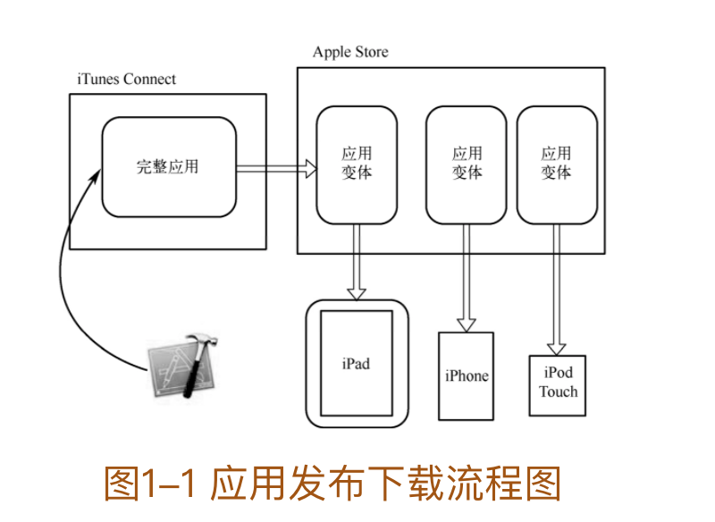
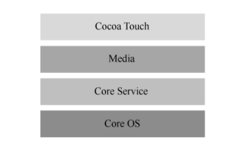
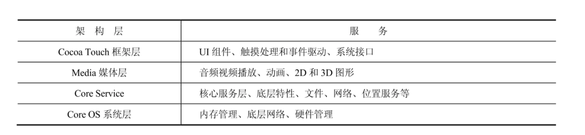

###### 1. 什么是“应用瘦身？”

“应用瘦身”（App thinning）是美国苹果公司自iOS 9发布的新特性，它能对Apple Store和操作系统进行优化，它根据用户的具体设备型号，在保证应用特性完整的前提下，尽可能地压缩和减少应用程序安装包的体积，也就是尽可能减少应用程序对用户设备内存的占用，从而减小用户下载应用程序的负担。Appthinning的实现主要有以下3种方法：Slicing、Bitcode和On-Demand Resources。以下将对这3种方法进行介绍。

1.Slicing在开发者将完整的应用安装包发布到Apple Store之后，AppleStore会根据下载用户的目标设备型号创建相应的应用变体（variants of the app bundle）。这些变体只包含可执行的结构和资源等必要部分，而不需要让用户下载开发者提供的完整安装包。图1-1展示了从开发者使用Xcode开发完整应用并发布到Apple Store后被用户下载到不同设备上的流程。

2.BitcodeBitcode是iOS中开发者的一个可选项，如果工程中开启了Bitcode，那么苹果会对开发者编译后的应用二进制文件进行二次优化，将其转换成一种中间代码（Bitcode），在AppleStore上进行编译和链接。Bitcode属于官方的一种新的优化技术，由于很多第三方库不支持Bitcode，所以很多时候不得不关闭Bitcode以保证程序的正常运行。

3.On-Demand Resources它是一种“按需供给”的资源加载方式，用户下载应用程序时不需要下载应用程序完整的资源，而是在用户使用过程中到了某个阶段需要用到某些资源（图片资源和声音资源等）时，才从后台的服务器下载同步，这种方式类似于资源的延迟加载，可以减轻本地内存的负担。这种方式在游戏等对资源使用量大的应用程序中效果最明显。另外，这些在后台延迟下载的资源在内存紧张时可以自动删除，从而极大地提高内存的利用率。

###### 2. 什么是Cocoa和Cocoa Touch

Cocoa和Cocoa Touch分别是OS X平台和iOS平台的应用开发环境，两个平台的环境都包含Objective-C的运行时环境和Foundation框架。

Cocoa用来开发OS X系统上的应用，它主要包括Foundation框架和AppKit界面开发框架。

Cocoa Touch用来开发iOS系统上的应用（主要指iPhone和iPad），它主要包括Foundation框架和UIKit界面开发框架。

###### 3.Cocoa Touch的底层技术架构是什么?

Cocoa Touch的底层技术架构主要分4层，每层负责的服务如图：

###### 4. 什么是谓词？

