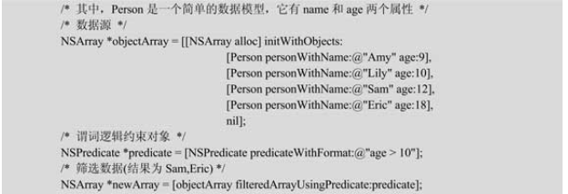
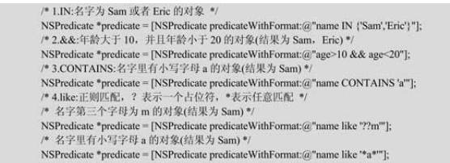
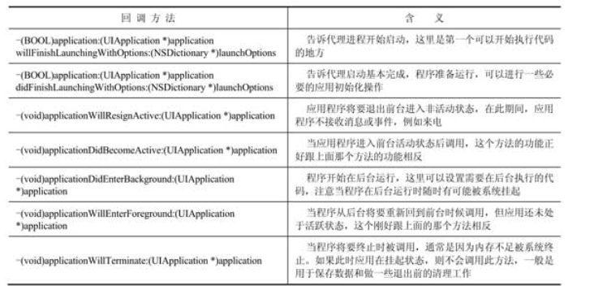

###### 1. 什么是“应用瘦身？”

“应用瘦身”（App thinning）是美国苹果公司自iOS 9发布的新特性，它能对Apple Store和操作系统进行优化，它根据用户的具体设备型号，在保证应用特性完整的前提下，尽可能地压缩和减少应用程序安装包的体积，也就是尽可能减少应用程序对用户设备内存的占用，从而减小用户下载应用程序的负担。Appthinning的实现主要有以下3种方法：Slicing、Bitcode和On-Demand Resources。以下将对这3种方法进行介绍。

1.Slicing在开发者将完整的应用安装包发布到Apple Store之后，AppleStore会根据下载用户的目标设备型号创建相应的应用变体（variants of the app bundle）。这些变体只包含可执行的结构和资源等必要部分，而不需要让用户下载开发者提供的完整安装包。图1-1展示了从开发者使用Xcode开发完整应用并发布到Apple Store后被用户下载到不同设备上的流程。

2.BitcodeBitcode是iOS中开发者的一个可选项，如果工程中开启了Bitcode，那么苹果会对开发者编译后的应用二进制文件进行二次优化，将其转换成一种中间代码（Bitcode），在AppleStore上进行编译和链接。Bitcode属于官方的一种新的优化技术，由于很多第三方库不支持Bitcode，所以很多时候不得不关闭Bitcode以保证程序的正常运行。

3.On-Demand Resources它是一种“按需供给”的资源加载方式，用户下载应用程序时不需要下载应用程序完整的资源，而是在用户使用过程中到了某个阶段需要用到某些资源（图片资源和声音资源等）时，才从后台的服务器下载同步，这种方式类似于资源的延迟加载，可以减轻本地内存的负担。这种方式在游戏等对资源使用量大的应用程序中效果最明显。另外，这些在后台延迟下载的资源在内存紧张时可以自动删除，从而极大地提高内存的利用率。

###### 2. 什么是Cocoa和Cocoa Touch

Cocoa和Cocoa Touch分别是OS X平台和iOS平台的应用开发环境，两个平台的环境都包含Objective-C的运行时环境和Foundation框架。

Cocoa用来开发OS X系统上的应用，它主要包括Foundation框架和AppKit界面开发框架。

Cocoa Touch用来开发iOS系统上的应用（主要指iPhone和iPad），它主要包括Foundation框架和UIKit界面开发框架。

###### 3.Cocoa Touch的底层技术架构是什么?

Cocoa Touch的底层技术架构主要分4层，每层负责的服务如图：

###### 4. 什么是谓词？

谓词（NSPredicate）是Objective-C中针对数据集合的一种逻辑筛选条件，它类似于数据库中SQL语句对数据筛选的限制约束条件。Objective-C中的谓词经常用来从数组（Array）、集合（Set）等数据集合中筛选数据元素，谓词约束条件封装在NSPredicate对象中，可通过类函数predicateWithFormat和逻辑约束语句进行初始化。

谓词筛选用法的示例代码如下：

它们与SQL语句中的语法基本相对应，除了最基本的逻辑运算符：>、==、<=、&&等之外，还有逻辑词IN、CONTAINS、like等。

###### 5.什么是“懒加载”

“懒加载”（Lazy loading）也被叫作“延迟加载”，它的核心思想是把对象的实例化尽量延迟，直到真正用到的时候才将其实例化，这样做的好处是可以减轻大量对象在实例化时对资源的消耗，而不是在程序初始化的时候就预先将对象实例化。另外，“懒加载”可以将对象的实例化代码从初始化方法中独立出来，从而提高代码的可读性，以便于代码能够更好地被组织。

###### 6. 类工厂方法是什么

类工厂方法就是用来快速创建对象的类方法，它可以直接返回一个初始化好的对象。UIKit中最典型的类工厂方法就是UIButton的buttonWithType类工厂方法，开发者使用这个方法指定按钮的类型就可以快速得到一个该类型的初始化好的按钮实例对象。

类工厂方法的几个必备特征如下：

1）一定是类方法。

2）返回值一定是id/instancetype类型，因为要返回一个对象。

3）规范的方法名会说明类工厂方法返回的是什么对象，一般是以类名首字母小写开始，例如这里buttonWithType说明返回的是一个button。

###### 7. App ID和Bundle ID有什么不同

App ID是一个组合字符串，它包括两个部分，一个是开发团队的ID，另一个是标识应用的Bundle ID，它们之间是用点隔开的。

开发团队的ID是苹果公司提供给开发者的，这个ID可以唯一标识一个开发团队；

Bundle ID是开发者自定义的唯一标识一个应用的。

一个团队的ID和不同的Bundle ID组合可以得到不同的App ID，这个App ID就可以标识该团队的不同的应用，开发者需要通过App ID来使自己的应用可以获取丰富的苹果服务，如iCloud服务等。

###### 8.什么是糖衣语法

糖衣语法，又叫“语法糖”“语法盐”等。指计算机语言中添加的某种语法，这种语法对语言的功能并没有影响，但是更方便程序员使用。通常来说，使用糖衣语法能够增加程序的可读性，从而减少程序代码出错的机会。

糖衣语法在各种语言中都有出现，最常用的就是数组的[]操作符的下标访问和{}操作符对数组的初始化。

在Objective-C中用到糖衣语法的一个非常重要的类型是NSNumber，一个将基本数据类型封装起来的对象类型，基本数据类型像“@3”这种表达就是NSNumber的糖衣语法。

糖衣语法在Objective-C中又常叫作“字面量”。

Objective-C中字面量的用法主要包括基本数据类型NSNumber、静态数组NSArray和字典NSDictionary、可变数组NSMultableArray和字典NSMultableDictionary。

###### 9. iOS应用的生命周期回调方法主要有哪些

###### 10. iOS应用有哪几种不同状态？分别表示什么含义

**非运行状态**:应用还没有运行起来（用户没有单机图标打开应用），或者正在运行的过程中被系统中断了的状态

**不活跃状态**：应用在前台运行但是不接受事件交互。比如：在运行某个应用的时候用户突然锁屏了，或者突然被强制转去处理一些像来电或者短信等系统紧急事件。

**活跃状态**：应用的正常使用状态，这时候应用在前台运行且接受用户交互事件，是前台应用的正常状态。

**后台状态**：应用被放到后台但还可能执行一些后台代码任务，通常进入到这个后台状态一会之后就会进入下面的挂起状态，不再执行代码，也就是应用先进入后台状态然后进入挂起状态。

**挂起状态**：在挂起状态，虽然应用放在内存中，但是不执行任何代码，处于“睡眠”状态。当挂起的应用太多导致内存低时，系统可能会自行清理掉挂起的应用来腾出空间给前台活跃的应用。

######  11. UIButton到NSObject之间的继承关系是怎样的

UIButton继承自UIControl，UIControl继承自UIView，UIView继承自UIResponder，UIResponder继承自最基本的类NSObject。

###### 12.Git和SVN有什么异同

Git和SVN都是用来对工程进行版本控制的，它们可以监控工程代码或资源等文件的更改变化，保证正确的内容提交或者撤销恢复到之前的工程版本，有利于实现高效的团队合作。

Git和SVN的主要不同之处在于它们的架构原理。

Git是分布式的，而SVN是集中式的。

由于Git是分布式的，所以每个开发者建的本地仓库都保存了整个工程的完整备份，而且与SVN不同的是，使用Git可以先在本地提交，在需要的时候再提交到远程仓库从而推送给其他开发者看到，提交的过程即是同步的过程。也就是说，Git允许本地仓库脱离远程服务器仓库进行本地工程的版本控制，而使用SVN每次提交时，都要和中心服务器仓库进行同步。

由于两者架构的不同，所以Git和SVN中的分支（Branch）概念也是不同的。分支在SVN中是一个完整的目录，包含所有的实际文件，和中心仓库是保持同步的，如果某个团队成员创建新的分支，那么会同步到所有的成员版本中，所有人都会受影响，即牵一发而动全身。而在Git下成员创建分支在合并前是不会影响任何人的，创建分支后可以在本地脱机进行任何操作，测试无误之后再提交合并到主分支，然后其他成员才能拉取看到。

另外，Git是把工程的内容按照元数据的方式存储，而SVN是把工程内容按照文件的方式存储。Git工程目录往往比SVN目录要大，因为Git目录中包含远程仓库所有的数据，如版本记录、标签和分支等。

