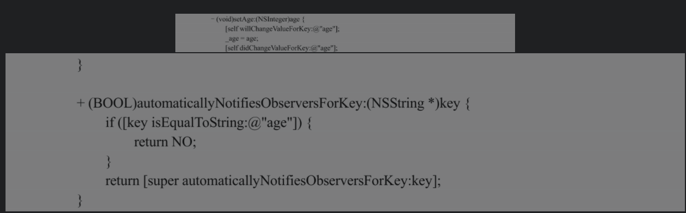

###### 1. iOS中的Protocol和Delegate

Protocol（协议）类似于Java语言中的接口，它是一个自定义方法的集合，让遵守这个协议的类去实现为了达到某种功能的这些方法，与Java语言中的接口不同的是协议中可以使用@optional来选择性实现某个方法。

Delegate（代理）是一种设计模式，是一个概念，只不过在Objective-C中通过Protocol来进行实现，指的是一个对象在某些特定时刻通知其他类的对象去做一些任务，但不需要获取到那些对象的指针，两者共同来完成一件事，实现不同对象之间的通信。

代理模式大大减小了对象之间的耦合度，它使得代码逻辑更加清晰有序，而且，由于降低了框架复杂度，所以便于代码的维护扩展。另外，消息的传递过程可以有参数回调，它类似于Java语言的回调监听机制，从而大大提高了编程的灵活性。

###### 2.Objective-C中的协议和Java语言中的接口有何区别?

Objective-C中的协议和Java语言中的接口非常类似，但Java语言中的接口规定实现接口的类必须要实现接口中定义的所有方法，当然默认Objective-C协议中定义的方法也是要必须实现的，只不过Objective-C的协议里的方法有两种类型：必选类型（@required）和可选类型（@optional）。必选类型是必须要实现的，而可选类型是根据需要选择性实现的。默认是必选类型。

###### 3.Objective-C中协议的概念以及协议中方法的默认类型是什么?

Objective-C中的协议类似于Java语言中的接口，它是一个功能方法的集合，但协议本身不是一个类，不会自己去实现协议里的方法，而是委托其他任何类去使用实现，通常用来实现委托代理设计模式，实现不同类对象之间的事件消息通信。协议中的方法默认都是@required类型的，也就是使用该协议的类必须实现协议里的这些方法。而明确使用@optional修饰的方法可以被使用的类选择性地去实现。

###### 4.什么是消息推送？和Notification有什么区别

消息推送指在App关闭时（不在前台运行时），仍然向用户发送App的内部消息。消息推送通知和Objective-C中的Notification通知机制不同，推送的消息是给用户看的，也就是可见的，而通知机制是Objective-C语言中对象间通信的一种机制，基于观察者模式，目的是触发内部事件，减小类之间的耦合度，对用户是不可见的。

推送消息的可见形式主要有以下几种：

1. 锁屏界面的横幅推送消息。
2. 顶部通知栏的横幅推送消息。
3. 应用图标上的代表消息数量的红色数字。
4. 菜单页面弹出框提示。
5. 播放声音提示。

iOS开发中有两种类型的消息推送：本地消息推送（LocalNotification）和远程消息推送（Remote Notification）：

1. 本地消息推送：本地消息推送很简单，不需要联网，不需要服务器，由客户端应用直接发出推送消息，一般通过定时器在指定的时间进行消息推送。
2. 远程消息推送：远程消息推送过程略为复杂，需要客户端从苹果公司的APNS（Apple Push Notification Services）服务器注册获得当前用户的设备令牌并发送给应用的服务器，然后应用的服务器才可以通过APNS服务器间接地向客户端发送推送消息，期间难免会有延迟。

远程消息推送的具体流程如图5-3所示，开发中要和服务器合作共同完成：

1. App客户端向APNS服务器发送设备的UDID和BundleIdentifier。
2.  APNS服务器对传过来的信息加密生成一个deviceToken，并返回给客户端。
3.  客户端将当前用户的deviceToken发送给自己应用的服务器。
4.  自己应用的服务器将得到的deviceToken保存，需要的时候利用deviceToken向APNS服务器发送推送消息。
5.  APNS服务器接收到自己应用的服务器的推送消息时，验证传过来的deviceToken，如果一致，那么将消息推送到客户端。

###### 5.什么是Notification？什么时候用Delegate或Notification

Notification（通知）是Cocoa框架中基于观察者模式实现的用于一对多传播消息的一种机制。项目中的对象将它们自己或者其他对象添加到通知的观察者列表里（这个过程又叫通知注册），其中项目中的所有通知都有一个唯一的字符串标识作为通知名唯一确定每个通知，通知源也就是被观察者可以创建通知对象并发送到通知中心，通知中心找出所有注册该通知的对象（观察者），并将从被观察者那里收到通知以消息的方式发送给所有的观察者们。被观察者发送通知是一个同步过程，即发送者在通知中心成功将该发送者之前的消息发送给所有观察者之前不可以再次发送通知。另外，通知触发的代理方法都必须符合某个单一参数签名约定，代理方法的参数是一个通知对象，参数里包含着通知名、被观察者和一个包含其他额外信息的字典。

Delegate和Notification的主要区别在于前者是一对一的消息传递，而后者是一对多的，可以根据这个特点在使用中进行选择。另外在代理模式中，reciever（接收者）可以返回值给sender（发送者），实现一种回调，而观察者模式中观察者不可以返回值给被观察者，因此在需要实现回调时只能选择代理模式。

###### 6.NSNotification是同步还是异步

NSNotification默认在主线程中通知是同步的，当通知产生时，通知中心会一直等待所有的观察者都收到并且处理通知结束，然后才会返回到发送通知的地方继续执行后面的代码，但可以将通知的发送或者将通知的处理方法放到子线程中从而避免通知阻塞。其中，通知的发送可以添加到NSNotificationQueue异步通知缓冲队列中，也不会导致通知阻塞。NSNotificationQueue是一个通知缓冲队列，通常以FIFO（先进先出）的规则维护通知队列的发送。向通知队列添加通知有3种枚举类型：NSPostASAP、NSPostWhenIdle和NSPostNow，分别表示尽快发送、空闲时发送和现在立刻发送，可以根据通知的紧急程度进行选择。

可以通过将通知的发送语句或者通知的处理语句放到子线程实现通知的异步。

###### 7. 什么是键值编码KVC？键路径是什么？什么是键值观察KVC

键值编码（KVC）是一种在NSKeyValueCoding非正式协议下使用字符串标志间接访问对象属性的一种机制，也就是访问对象变量的一种特殊的捷径。

如果一个对象符合键值编码的约定，那么它的属性就可以通过一个准确的、唯一的字符串（键路径字符串）参数进行访问，类似于将所有对象看作Dictionary，键路径为key（实际为keypath），属性值即value，通过键路径访问属性值。

键值编码的间接访问方式其实是传统实例变量的存取方法访问的一种替代，也就是另外一种可以访问对象变量的方法。

其中，注意键值编码可以暴力访问对象的任何变量，无论是否是pirvate私有类型的变量。

键值编码是Cocoa框架中很基础的一个概念，像KVO、Cocoa绑定、CoreData等都是基于KVC的。

键路径就是键值编码中某个属性的key，一个由连续键名组成的字符串，键名即属性名，键名之间用点隔开，用于指定一个连接在一起的对象性质序列。键路径使开发者可以独立于模型实现的方式指定相关对象的性质。通过键路径，可以指定对象图中的一个任意深度的路径，使其指向相关对象的某个特定的属性。

键值观察（KVO），是基于键值编码实现的一种观察者机制，提供了观察某一属性变化的监听方法，用来简化代码，优化逻辑和组织。

###### 8. KVC的应用场景有哪些

1. 动态地取值和设值

2. 利用KVC来访问、修改对象的私有变量和属性

3. 利用KVC进行Model和字典之间的转换

   使用KVC中提供的setValuesForKeysWithDictionary:，可以将字典映射到一个对象，不需要一一地为对象赋值而直接从字典中初始化即可。

4. 利用KVC实现高阶消息传递

   当对容器类（如NSArray类）使用KVC时，valueForKey:将会被传递给容器中的每一个对象，而不是对容器本身进行操作。相应的结果会被添加进返回的容器中，这样可以很方便地操作集合来返回另一个集合。

###### 9. 如何运用KVO进行键值观察

利用KVO实现键值观察主要通过以下几个步骤：

1. 注册成为观察者
2. 设置需要被观察对象的属性
3. 在回调方法中处理变更通知
4. 移除观察者

###### 10.KVO的背后原理是什么

当某个类的对象第一次被观察时，系统就会在运行时动态地创建对应于该类的一个派生类，在这个派生类中系统会重写父类中被观察属性的setter方法。在重写的setter方法中实现了真正的通知机制。

当调用age属性的stter方法时，在属性值改变的前后会分别调用willChangeValueForKey：方法和didChangeValueForKey：方法，这两个方法分别用于通知系统该属性值即将发生变化和已经发生变化。实现了automaticallyNotifiesObserversForKey:方法后，在这个方法中取消了属性变更发送通知的操作。

要通过KVO来实现观察者模式，必须遵循KVO的属性设置方式（KVC或者setter方法）来变更属性值，如果仅是直接修改属性对应的成员变量，那么是无法实现KVO的。

当系统在运行时创建派生类的同时，派生类还重写了class方法来“欺骗”开发者，让开发者以为正在调用的类还是原始类。然后系统会将这个对象的isa指针指向新创建的派生类，因此这个对象就成为该派生类的对象了，因而当开发者调用属性的setter方法时，实际上是调用了重写之后的setter方法，从而实现了键值通知机制。此外，派生类还重写了dealloc方法来释放内存资源。

###### 11.setValue：forKey：方法的底层实现是什么

当一个对象发送setValue:forKey:消息时，方法内部会做以下操作：

1. 查对象的类中是否存在与key相对应的访问器方法（即-set<key>），如果存在，那么就会直接调用访问器方法。
2. 如果访问器方法不存在，那么就会继续查找与key的名称相同并且带“_”前缀的成员变量（即_key）。如果存在这样的成员变量并且类型是一个对象指针类型，那么就会先released成员变量的旧值，然后直接为对象的这个成员变量赋新值。
3. 如果_key不存在，那么就会继续查找与key的名称相同的属性。如果有这样的属性，那么就会直接为对象的这个属性赋值。
4. 如果访问器方法、成员变量和属性都没有找到，那么就会调用setValue:forUndefined Key:方法，该方法的默认实现是抛出一个NSUndefinedKeyException类型的异常，但是可以根据需要重写setValue:forUndefinedKey:方法。

###### 12. NSMutableDictionary中setValue和setObject有什么区别

NSMutableDictionary中setValue:forKey:方法和setObject:forKey:方法的主要 区别有：

1. setObject:forKey:方法是NSMutableDictionary类特有的，只有NSMutableDictionary类及其子类的实例化对象能够使用，而setValue:forKey:方法是KVC的主要方法，只要遵循了NSCoding协议的对象都能够使用。
2. setObject:forKey:方法中参数value的值不能为nil，否则会抛出异常。而setValue:for Key:中value能够为nil，只是当value为nil的时候，会自动调用removeObject:forKey:方法。
3. setValue:forKey:中key的参数只能够是NSString类型，而setObject:forKey:的key可以是任何类型的对象类型。

###### 13.NSNotification、Delegate、Block和KVO的区别是什么

Delegate（代理）是一种回调机制，是一对一的关系；而通知是基于观察者模式的一对多的关系，消息会发送给所有注册为事件观察者的对象；Delegate比Notification的执行效率要高。

Block和Delegate一样通常也是一对一的通知，使用场景相同，可以说Block是Delgate的另一种形式，但Block更加简洁直接且轻便灵活，不需要像Delegate那样需要定义协议很多方法，而且代理对象要实现协议方法，还需要建立对象间的代理关系才可以通信。在通信事件比较多的情况下，还是建议使用Delegate，Delegate的定义实现形式更加直观清楚。

KVO就是Cocoa框架实现的观察者模式，一般同KVC搭配使用，通过KVO可以监测一个值的变化。例如，View的高度变化是一对多的关系，一个值的变化会通知所有的观察者。NSNotification是通知，也是一对多的使用场景。在某些情况下，KVO和NSNotification是一样的，都是状态变化之后告知对方。

NSNotification的特点是需要被观察者先主动发出通知，然后观察者注册监听后再来进行响应，比KVO多了发送通知的一步，但是其优点是监听不局限于属性的变化，还可以对多种多样的状态变化进行监听，监听范围广，使用也更灵活。

KVO一般的使用场景是数据，需求是数据变化，例如股票价格变化一般使用KVO（观察者模式）实现。Delegate一般的使用场景是行为，需求是需要别人帮我做一件事情，例如买卖股票就一般使用Delegate来实现。Notification一般是进行全局通知，例如好消息一出，通知大家去买入。Delegate是强关联，就是委托和代理双方互相知道，你委托别人买股票你就需要知道经纪人，经纪人也需要知道自己的顾客。Notification是弱关联，利好消息发出，你不需要知道是谁发的也可以做出相应的反应，同理发消息的人也不需要知道接收的人就可以正常发出消息。