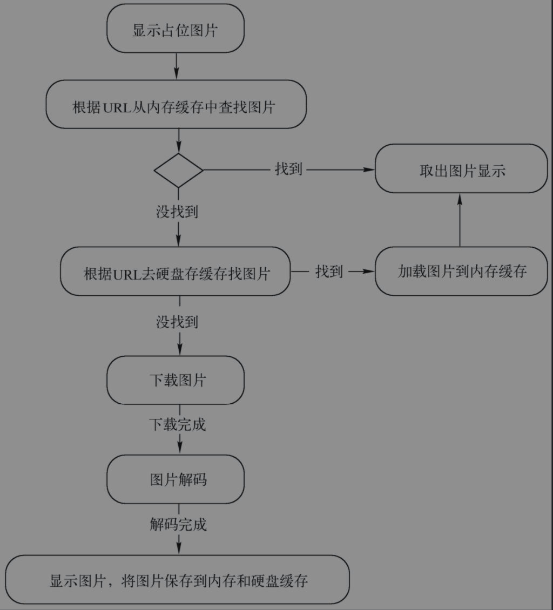

###### 1. SDWebImage是什么？加载图片的原理是什么

SDWebImage是一个针对图片加载的插件库，提供了一个支持缓存的用于异步加载图片的下载工具，特别为常用的UI元素：UIImageView、UIButton和MKAnnotationView提供了类别扩展，可以作为一个很方便的工具。其中，SDWebImagePrefetcher可以预先下载图片，方便后续使用。

SDWebImage的几点特性：

1. 为UIImageView、UIButton和MKAnnotationView进行了类别扩展，添加了Web图片和缓存管理。
2. 是一个异步图片下载器。
3. 异步的内存+硬盘二级缓冲以及自动的缓冲过期处理。
4. 后台图片解压缩功能。
5. 可以保证相同的URL（图片的检索key）不会被重复多次下载。
6. 可以保证假的无效URL不会不断尝试去加载。
7. 保证主线程不会被阻塞。
8. 性能高。
9. 使用GCD和ARC。

支持的图片格式：

1. UIImage支持的图片格式有JPEG、PNG等，包括GIF都可以被支持。
2. Web图片格式，包括动态的Web图片（使用WebPsubspec）。

SDWebImage加载图片的流程原理：

根据流程可以知道，图片的加载采用了一种二级缓存机制，简单概括意思就是：能从内存缓存直接取就从内存缓存取，内存缓存没有就去硬盘缓存里取，再没有就根据提供的URL到网上下载（下载自然会慢很多），下载的图片还有一个解码的过程，解码后就可以直接用了，另外下载的图片会保存到内存缓存和硬盘缓存，从而下次再取同样的图片就可以直接取了而不用重复下载。

上面的整个流程对应到SDWebImage框架内部，依次会挖掘出下面几个关键方法。最外层的是程序员直接调用的sd_setImageWithURL方法，以此方法为入口依次可能会调用到后面的方法，来完成上面的整个优化加载流程，这里以其中一个入口方法为例：

1. sd_setImageWithURL

   UIImageView(WebCache)的sdsetImageWithURL方法只是个UIView的类扩展接口方法，负责调用并将参数传给UIView(WebCache)的sdinternalSetImage WithURL方法，参数这里有图片的URL和placeholder占位图片。

2. sd_internalSetImageWithURL

   UIView(WebCache)的sd_internalSetImageWithURL方法先将placeholder占位图片异步显示，然后给SDWebImageManager单例发送loadImageWithURL消息，传给它URL参数让其再给它的SDImageCache对象发送queryCacheOperationForKey消息先从本地搜索缓存图片。

3. loadImageWithURL

   收到loadImageWithURL消息后，SDWebImageManager单例向SDImageCache对象发送queryCacheOperationForKey消息开始在本地搜索缓存图片，SDImageCache对象先对自己发送imageFromMemoryCacheForKey消息从内存中搜索图片缓存，搜到则取出图片并通过SDCacheQueryCompletedBlock回调返回，否则再对自己发送diskImageForKey消息去硬盘搜索图片，搜到则取出图片通过SDCacheQueryCompletedBlock回调返回，内存和硬盘都搜不到则只好重新下载。

4. downloadImageWithURL

   如果本地搜索失败，那么SDWebImageManager会新建一个SDWebImageDownloader下载器，并向下载器发送downloadImageWithURL消息开始下载网络图片；下载成功并解码后一方面将图片缓存到本地，另一方面取出图片进行显示。其中，像图片下载以及图片解码等耗时操作都是异步执行，不会拖慢主线程。

   SDImageCache在初始化的时候会注册一些消息通知，在内存警告或退到后台的时候会清理内存图片缓存，应用结束的时候会清理掉过期的图片。

​       

######2. SDWebImage框架内部在清理磁盘缓存的时候clearDisk方法和cleanDisk方法有什么区别?

 clearDisk方法清空磁盘缓存，删除缓存目录中的所有文件，然后创建一个新的同名空文件。

cleanDisk方法按照磁盘清理缓存策略清理缓存，没有直接将所有缓存删除，而是先遍历缓存文件并删除已经过期的文件，如果剩余缓存空间超出了限额，那么按照文件创建的时间从远到近依次删除，清理到低于期望的缓存限额为止。SDWebImage中的期望缓存限额为最大限额的一半。

######3.SDWebImage框架的框架结构是怎么样的?

SDWebImage框架的3个核心组件：

1. SDWebImageManager：核心管理器。
2. SDImageCache：缓存处理组件，主要对下载的图片进行内存缓存和磁盘缓存处理。
3. SDWebImageDownloader|SDWebImageDownloadOperation：下载处理组件，主要负责在子线程中发送异步网络请求下载图片以及其他相关操作。

###### 4. 网络图片处理问题中怎么解决一个相同的网络地址重复请求的问题?

可以通过建立一个以图片下载地址为key，以下载操作为value的字典，图片地址是唯一的，可以保证key值唯一。当需要加载该图片时，先根据key值去本地缓存中找，看该图片是否已经下载，如果key值匹配，那么直接从本地取图片资源从而避免重复下载操作，如果本地找不到，那么需要根据key值中的网络图片地址重新去网络上下载。

###### 5. CocoaPods的原理

CocoaPods的原理就是将所有的依赖库都放到一个名为Pods的项目中，然后让主项目依赖这个Pods项目，这样就分离第三方依赖和主项目之间的依赖关系，所有第三方依赖都由Pods项目管理。Pods项目最终会被编译为一个libPods.a的文件，主项目中引用这个libPods文件就能使用所有的第三方框架。

CocoaPods是用来管理iOS项目中第三方框架的工具，主要是通过建立Podfile文件，在文件中指定项目中需要的第三方框架，然后使用pod install安装框架。

其主要原理是：Pods项目中的第三方框架最终会编译成一个名为libPods.a的文件，主项目依赖这个.a文件即可；对于资源文件，CocoaPods提供了一个名为Pods-resources.sh的bash脚本，该脚本在每次项目编译的时候都会执行，将第三方的各种资源文件复制到目标目录中；CocoaPods通过一个名为Pods.xcconfig的文件在编译时设置所有的依赖和参数。

###### 6. 为什么要使用CocoaPods

当我们需要使用第三方框架的时候，使用CocoaPods能够快速地将开源框架的代码集成到项目中，并自动添加动态库和依赖框架，设置预编译-ObjC，fno-objc-arc等，从而实现第三方框架的使用和更新管理。

###### 7. CocoaPods的核心组件

1. Podfile 配置文件，将需要用到的第三方框架写入到这个文件中，并根据项目的需要标注好版本号。
2. Podfile.lock 版本控制文件，里面记录了每个第三方框架的版本，防止项目中不同成员使用的第三方框架的版本号不一致。
3. .xcworkspace 工程的入口文件。
4. Pods 里面存放了所有使用到的第三方框架。

###### 8. BAD_ACCESS在什么情况下出现

BAD_ACCESS报错属于内存访问错误，它会导致程序崩溃，而错误的原因是访问了野指针（悬挂指针）。野指针指本来指针指向的对象已经释放了，但指向该对象的指针没有置nil，指针指向随机的未知的内存，程序还以为该指针指向目标对象，导致存在一些潜在的危险访问操作，这些危险访问操作无法被指针指向的未知内存所处理，就会导致BAD_ACCESS错误造成程序崩溃。访问的含义包括多种情况，如向野指针发送消息，读写野指针本来指向的对象的成员变量等。

###### 9.如何调试BAD_ACCESS错误

调试BAD_ACCESS错误是比较困难的事情，BAD_ACCESS错误是由于访问了野指针，但程序不会在野指针出现时或者在访问野指针的代码处报错，这就导致对其难以察觉。调试BAD_ACCESS错误的思路如下。

1. 开启僵尸对象诊断

   僵尸对象指的是引用计数为0被系统回收的对象，但这些对象暂时还存在内存中，且理论上还是可以使用的，但是不稳定。开启僵尸对象诊断后，僵尸对象会暂时保持活跃用于调试，野指针在对象回收后依然指向该僵尸对象，访问野指针也就是访问僵尸对象的情况下可以被编辑器检测出来。

2. Analyze（分析）

   僵尸对象诊断可以帮助快速定位多数情况下的野指针问题，但有时候不能奏效，这个时候只能利用Xcode的Analyze静态分析帮助检查可能存在问题的地方，而仔细检查问题所在比较费时。

###### 10. 如何查看设备应用的crash日志

crash日志可以分成两种：一种是应用发布App Store后，用户的crash日志会上传，开发者可以在iTunes Connect上查看，但前提是用户在手机设置中开启了“诊断与用量”选项，用户同意分享应用崩溃日志等信息给开发者（具体位置位于：设置→隐私→诊断与用量）。

另一种是开发者在开发测试时查看crash日志信息。查看测试过程中的日志也有多种途径，例如运行时可以连接Mac（模拟器或真机调试）在本地目录中查看：~/Library/Logs/CrashReporter/MobileDevice/设备名称/。日志文件扩展名为.crash或.ips。

###### 11.如何检测内存泄漏

检测内存泄漏主要有以下3种方法：

1. 静态分析

   通过静态分析可以初步地了解到代码的一些不规范的地方或者是存在内存泄漏的地方，这是对内存泄漏的第一步检测。当然有一些警告是不需要关心的，可以略过。

2. 通过instruments来检查内存泄漏

   这个方法能粗略地定位在哪里发生了内存泄漏。方法是完成一个循环操作，如果内存增长为0，那么就证明程序在该次循环操作中不存在内存泄漏；如果内存增长不为0，那么就证明有可能存在内存泄漏。当然具体问题需要具体分析。

3. 代码测试内存泄漏

   在做这项工作之前，要注意在dealloc的方法中是否已经释放了该对象所拥有的所有对象。观察对象的生成和销毁是否配对。准确地说，就是init（创建对象的方法）和dealloc是否会被成对触发（简单来说就是有一次创建对象就有一次dealloc该对象）。

###### 12.lldb（gdb）常用的调试命令有哪些

lldb是Xcode4.3之后默认的调试器（gdb是之前旧版本的调试器），在程序运行起来停在断点处时，可以在Xcode底部调试窗口使用lldb调试命令进行值的打印、值的改变以及执行特定指令步骤等操作。

1. help 最简单的指令，可以打印所有的命令和命令介绍。
2. po或p 打印变量或对象，会调用对象的description方法。
3. expression 可以在调试时动态执行指定表达式，并将结果打印出来。常用于在调试过程中修改变量的值。
4. lldb改变UI控件的属性 例如图10-11的例子，可以将当前页面的背景颜色改成红色。
5. bt 打印调用堆栈，加all可打印所有thread的堆栈。

