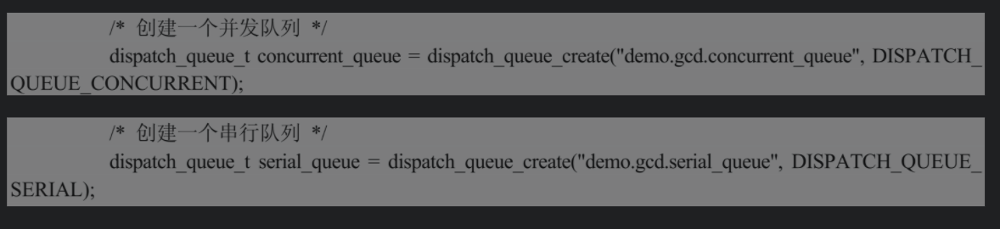
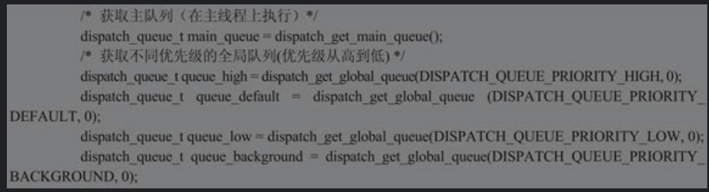
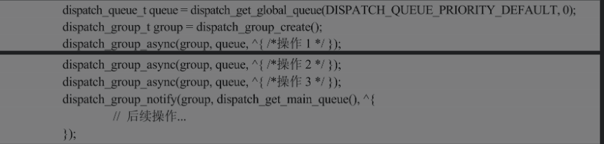
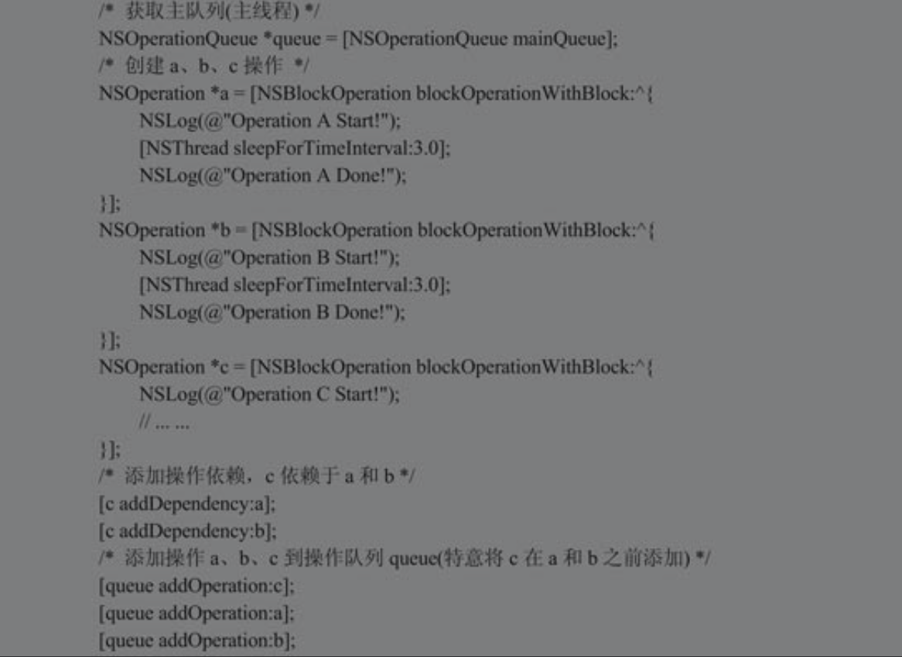
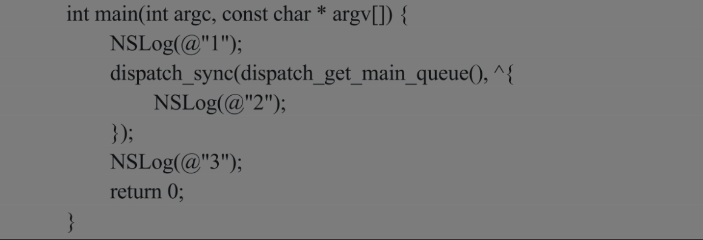

###### 1. GCD

1. 串行与并发（Serial和Concurrent）

   这个概念在创建操作队列的时候有宏定义参数，用来指定创建的是串行队列还是并行队列。

   串行指队列内任务一个接一个地执行，任务之间要依次等待不可重合，且添加的任务按照先进先出（FIFO）的顺序执行，但并不是指这就是单线程，只是同一个串行队列内的任务需要依次等待排队执行避免出现竞态条件，仍然可以创建多个串行队列并行地执行任务。也就是说，串行队列内是串行的，串行队列之间仍然是可以并行的，同一个串行队列内的任务的执行顺序是确定的（FIFO），且可以创建任意多个串行队列。

   并行指同一个队列先后添加的多个任务可以同时并列执行，任务之间不会相互等待，且这些任务的执行顺序和执行过程不可预测。

2. 同步和异步任务派发（Synchronous和Asynchronous）

   GCD多线程编程时经常会使用dispatch_async和dispatch_sync函数向指定队列中添加任务块，区别就是同步和异步。

   同步指阻塞当前线程，即要等添加的耗时任务块block完成后，函数才能返回，后面的代码才可以继续执行。如果在主线上，那么会发生阻塞，用户会感觉应用不响应，这是要避免的。有时需要使用同步任务的原因是想保证先后添加的任务要按照编写的逻辑顺序依次执行。

   异步指将任务添加到队列后函数立刻返回，后面的代码不用等待添加的任务完成返回即可继续执行。异步提交无法确认任务的执行顺序。

3. dispatch_queue_t

   GCD队列有两种类型：并发队列和串行队列。它们的区别上面已经提到，具体创建的方法很简单，要提供两个参数，一个是标记该自定义队列的唯一字符串；另一个是指定串行队列还是并发队列的宏参数。

   

​    GCD还提供了几个常用的全局队列以及主队列，其中全局队列本质是并发队列，主队列本质是串行队列，获取方法如下：

4. dispatch_once_t

   这个函数控制指定代码只会被执行一次，常用来实现单例模式。这里以单例模式实现的模板代码为例展示dispatch_once_t的用法，其中的实例化语句只会被执行一次。

5. dispatch_after

   通过该函数可以让要提交的任务在从提交开始后的指定时间执行，也就是定时延迟执行提交的任务。

6. dispatch_group_t

   组调度可以实现等待一组操作都完成后执行后续操作。典型的例子是大图片的下载，例如可以将大图片分成几块同时下载，等各部分都下载完再后续将图片拼接起来，提高下载的效率。

   

7. 同步代码到主线程

   对于UI的更新代码，必须要在主线程上执行才会及时有效，当当前代码不在主线程时，需要将UI更新的部分代码单独同步到主线程。同步的方法有3种，可以使用NSThread类的performSelectorOnMainThread方法或者NSOperationQueue类的mainQueue主队列来进行同步，但推荐直接使用GCD方法。

###### 2. 什么是线程？线程与进程有什么区别？为什么要使用多线程

线程指程序在执行过程中，能够执行程序代码的一个执行单元。线程主要有4种状态：运行、就绪、挂起、结束。

进程指一段正在执行的程序。而线程有时候也被称为轻量级进程，是程序执行的最小单元。一个进程可以拥有多个线程，各个线程之间共享程序的内存空间（代码段、数据段和堆空间）及一些进程级的资源（例如打开的文件），但是各个线程拥有自己的栈空间。

在操作系统级别上，程序的执行都是以进程为单位的，而每个进程中通常都会有多个线程互不影响地并发执行

为什么要使用多线程呢?

1. 使用多线程可以减少程序的响应时间。在单线程（单线程指程序执行过程中只有一个有效操作的序列，不同操作之间都有明确的执行先后顺序）的情况下，如果某个操作很耗时，或者陷入长时间的等待（如等待网络响应），那么此时程序将不会响应鼠标和键盘等操作，使用多线程后，可以把这个耗时的线程分配到一个单独的线程去执行，使得程序具备了更好的交互性。
2. 与进程相比，线程的创建和切换开销更小。由于启动一个新的线程必须给这个线程分配独立的地址空间，建立许多数据结构来维护线程代码段、数据段等信息，而运行于同一进程内的线程共享代码段、数据段，所以线程的启动或切换的开销比进程要少很多。同时多线程在数据共享方面效率非常高。
3. 多CPU或多核计算机本身就具有执行多线程的能力，如果使用单个线程，那么将无法重复利用计算机资源，造成资源的巨大浪费。因此，在多CPU计算机上使用多线程能提高CPU的利用率。
4. 使用多线程能简化程序的结构，使程序便于理解和维护。一个非常复杂的进程可以分成多个线程来执行。

###### 3.如何理解多线程

多线程技术的优点如下：

1. 可以很大程度上提高程序的执行效率，提高程序的响应速度。
2. 使用线程可以把占据时间长的程序中的任务放到后台去处理，这样就不会阻塞程序主线程，用户体验更好（耗时操作会卡住主线程，严重影响UI的流畅度）。
3. 提高计算机资源的利用率，如：更加充分利用内存，多CPU计算机上提高CPU利用率。
4. 将进程分块，优化简化程序逻辑结构。

多线程技术的缺点如下：

1. 多线程程序的代码会更加复杂、难读，增加交接和维护难度。
2. 创建和调度线程会有额外的开销，线程越多，开销越大，甚至反而降低程序的性能。
3. 通常模型数据是在多个线程间共享的，需要防止线程死锁情况的发生。

###### 4. 如何理解HTTP协议

超文本传输协议（HyperText Transfer Protocol，HTTP）是互联网上应用最为广泛的一种网络协议。简单来说，HTTP是客户端和服务器端之间请求和应答的标准，它可以使浏览器（或其他客户端）更加高效，使网络传输减少。它不仅保证计算机正确快速地传输超文本文档，还确定传输文档中的哪一部分，以及哪部分内容优先显示（如文本先于图形）等。

一次HTTP操作称为一个事务，其工作过程可分为4步：

1. 客户端与服务器需要建立连接。例如，单击某个超链接后，浏览器和服务器将建立通信连接。
2. 建立连接后，客户端发送一个请求给服务器，请求方式的格式为：统一资源标识符（URL）、协议版本号，后边是MIME信息包括请求修饰符、客户端信息和可能的内容。
3. 服务器接到请求后，给予相应的响应信息，其格式为一个状态行，包括信息的协议版本号、一个成功或错误的代码，后边是MIME信息包括服务器信息、实体信息和可能的内容。
4. 客户端接收服务器所返回的信息通过浏览器显示在用户的显示屏上，然后客户机与服务器断开连接。

如果在以上过程中的某一步出现错误，那么产生错误的信息将返回到客户端，由显示屏输出。对于用户来说，这些过程是由HTTP自己完成的，用户只要用鼠标单击，等待信息显示就可以了。

HTTP的头域包括通用头、请求头、响应头和实体头4个部分。

每个头域由一个域名、冒号（:）和域值组成。

域名是大小写无关的，域值前可以添加任何数量的空格符，头域可以被扩展为多行，在每行开始处，使用至少一个空格或制表符。

###### 5.HTTPS协议与HTTP协议有什么区别与联系

HTTPS在HTTP的基础上加入了SSL协议，SSL依靠证书来验证服务器的身份，并为浏览器和服务器之间的通信加密。

HTTPS和HTTP的区别主要为以下4点：

1. HTTPS协议需要从CA （Certificate Authority）申请一个用于证明服务器用途类型的证书，一般免费证书很少，需要交费。
2. HTTP是超文本传输协议，信息是明文传输，HTTPS则是具有安全性的SSL加密传输协议。
3. HHTP和HTTPS使用的是完全不同的连接方式，用的端口也不一样，前者是80，后者是443。
4. HTTP的连接很简单，是无状态的；HTTPS协议是由SSL+HTTP协议构建的可进行加密传输、身份认证的网络协议，比HTTP协议安全。

###### 6.用户下载一个大图片，分成很多份下载，如何使用GCD实现

使用Dispatch Group追加block到Global Group Queue，这些block如果全部执行完毕，那么就会执行通过dispatch_group_notify添加到主队列中的block，进行图片的合并处理。

###### 7.项目中什么时候选择使用GCD？什么时候选择NSOperation

NSOperation是对线程的高度抽象，提供Objective-C语言接口，具备面向对象特性（复用、封装），可子类化NSOperation进行操作对象的复用，使程序逻辑结构更清晰。比起GCD，NSOperation可以直接设置操作之间的依赖关系实现线程同步，而且可以通过调用cancel方法中途取消操作，而在GCD中不可取消。NSOperation的线程逻辑控制更加精细灵活，同时复杂度较GCD要高，因此建议在有特殊需求的复杂项目中使用。

GCD的最大优点是非常简单、易用，经过了官方的优化更加安全高效（多数函数是线程安全的）。对于不复杂的多线程操作，会节省代码量，尤其block参数的使用，使代码更为易读，建议在简单项目中广泛使用。

###### 8.对于a、b、c 3个线程，如何使用NSOpertion和NSOpertionQueue实现执行完a和b后再执行c的结果?

###### 9. 下面代码有什么问题?

在上述代码中，main函数中第二句代码在主线程上使用了dispatch_sync同步向主线程派发任务，而同步派发要等到任务完成后才能返回，阻塞当前线程。也就是说，执行到此处，主线程被阻塞，同时又要等主线程执行完成该任务，造成主线程自身的等待循环，也就是死锁。程序运行到此处会崩溃。将dispatch_sync改为dispatch_async异步派发任务即可避免死锁，或者将任务派发到其他队列上而不是主队列。

###### 10.  如何实现Cocoa中多线程的安全

1. 对于UI界面的刷新访问操作要保证在主线程上，防止不能及时响应造成意想不到的结果。
2. 应用多线程要防止数据资源的抢夺，可通过使用@synchronized进行加锁在临界区安全地访问数据。
3. 尽量使用GCD开发多线程程序，防止线程安全的问题，因为GCD是经过优化的且很多函数默认就是线程安全的，可以大大减少开发过程中的线程安全问题。

###### 11. 如何实现Cocoa中多线程的安全

1. 对于UI界面的刷新访问操作要保证在主线程上，防止不能及时响应造成意想不到的结果。
2. 应用多线程要防止数据资源的抢夺，可通过使用@synchronized进行加锁在临界区安全地访问数据。
3. 尽量使用GCD开发多线程程序，防止线程安全的问题，因为GCD是经过优化的且很多函数默认就是线程安全的，可以大大减少开发过程中的线程安全问题。

###### 12. 在iOS开发中主要使用如下几种线程锁技术：

1. @synchronized关键字

2. NSLock

   NSLock对象是iOS中为了保证临界资源的原子性操作和临界区的原子性执行而封装的。需要注意的是，NSLock对象中的unlock操作必须与lock操作使用相同的线程，否则会出现未知错误。此外，同一线程在lock之后，未unlock之前，再次lock会导致永久性死锁。

   除了NSLock之外，iOS还提供了NSRecursiveLock类和NSConditionLock类，前者通常在递归操作中使用，后者可以创建一个指定开锁条件的锁对象，只有满足条件，才能开锁。

3. GCD

   GCD提供了一种信号的机制，使用它可以创建锁。信号量是一个整型值并且具有一个初始计数值，可支持两个操作：信号通知和等待。当一个信号量被信号通知，其计数会被增加。当一个线程在一个信号量上等待时，线程会被阻塞（如果有必要），直至计数器大于零，然后线程会减少这个计数。

###### 13. 在block中使用self关键字是否一定导致循环引用

在block中使用self关键字并不总会引起循环引用。事实上，只有当block和self相互持有时，才会导致循环引用。由于block会对block中的对象进行持有操作，就相当于持有了其中的对象，此时如果block中的对象又持有了该block，那么就会造成循环引用。

典型的场景就是当block作为self的属性使用时，又在block内部调用了self的属性或者方法。

###### 14.  GCD中有哪几种队列

1. 串行队列。串行队列中的任务按先后顺序逐个执行，通常用于同步访问一个特定的资源。使用dispatch_queue_create函数，可以创建串行队列。
2. 并发队列。在GCD中也称为全局并发队列，可以并发地执行一个或者多个任务。并发队列有高、中、低、后台4个优先级别，中级是默认级别。可以使用dispatch_get_global_queue（DISPATCH_QUEUE_PRIORITY_DEFAULT,0）函数来获取全局并发队列对象。串行队列和异步队列的区别在于同步执行和异步执行时的表现。
3. 主队列。它是一种特殊的串行队列。它在应用程序的主线程中用于更新UI。其他的两种队列不能更新UI。使用dispatch_get_main_queue函数，可以获得主队列对象。

###### 15.iOS中如何触发定时任务或延时任务

1. performSelector实现延时任务

2. 利用sleep实现后面任务的等待

3. 通过GCD实现block代码块的延时执行。

4. NSTimer实现定时任务

   NSTimer主要用于开启定时任务，但要正确使用才能保证它能够正常有效地运行。尤其要注意以下两点：1）确保NSTimer已经添加到当前RunLoop。2）确保当前RunLoop已经启动。

   

   NSTimer可能在主线程中创建，也可能在子线程中创建。主线程中的RunLoop默认是启动的，所以timer只要添加到主线程RunLoop中就会被执行；而子线程中的RunLoop默认是不启动的，所以timer添加到子线程RunLoop中后，还要手动启动RunLoop才能使timer被执行。

   NSTimer只有添加到启动起来的RunLoop中才会正常运行。NSTimer通常不建议添加到主线程中执行，因为界面的更新在主线程中进行，这会影响NSTimer的准确性。

5. CADisplayLink实现定时任务

   CADisplayLink实现的定时器与屏幕刷新频率绑定在一起，是一种帧率刷新，适用于界面的不断重绘（例如流畅动画和视频播放等）。CADisplayLink以特定模式注册到RunLoop后，每当屏幕显示内容刷新结束后就会向CADisplayLink指定的target发送一次消息，实现target的每帧调用。根据需求也可以设置每几帧调用一次，默认每帧都调用。另外，通过CADisplayLink还可以获取帧率和时间等信息。CADisplayLink实现的定时器精度非常高，但如果调用的方法十分耗时，超过一帧的时间间隔，那么会导致跳帧，跳帧次数取决于CPU的忙碌程度。

###### 16. MVC设计模式有哪些优缺点?

   MVC的优点如下：

1. 代码具有低耦合的特性

   在MVC设计模式中，由于视图层、业务层和数据层的分离，每个模块之间相互独立，这样就允许更改视图层代码而不用重新编译模型和控制器代码。同样，一个应用程序的业务流程或者业务规则的改变只需要改动MVC的模型层即可。

2. 高重用性和可适用性

3. 较低的生命周期成本和高可维护性

   MVC设计模式使视图层和业务逻辑层分离，使得应用更易于维护和修改，开发和维护用户接口的技术含量降低，技术人员只要关心指定模块的代码逻辑即可。

4. 有利于软件工程化管理

   由于不同的层各司其职，每一层不同的应用具有某些相同的特征，有利于通过工程化、工具化管理程序代码。

MVC的缺点如下：

1. 增加了系统结构和实现的复杂性

   MVC设计模式适合用户界面和业务逻辑比较复杂的应用程序。对于简单的界面，严格遵循MVC设计模式，使模型、视图与控制器分离，会增加结构的复杂性，并可能产生过多的更新操作，降低运行效率。

2. 视图与控制器间的过于紧密的连接

   虽然视图与控制器之间是相互分离的，但在实际开发中，视图与控制器确又是联系紧密的部件，视图没有控制器的存在，其应用是很有限的，反之亦然，这样就妨碍了它们的独立重用。

3. 视图对模型数据的低效率访问

   依据模型操作接口的不同，视图可能需要多次调用才能获得足够的显示数据。对未变化数据的不必要的频繁访问，也将损害操作性能。

4. 控制器臃肿

   大量逻辑处理代码全部放入ViewController控制器中，加上要遵循很多协议，会导致其变得臃肿和混乱，难以维护和管理，也难以分离模块进行测试。

5. 缺少专门放网络逻辑代码的部分

   导致网络逻辑处理只能放在Controller控制器中，加剧了Controller控制器部分的臃肿问题。

###### 17. 如何理解MVVM设计模式

MVVM是由微软公司提出的一种新的设计架构，它基于MVC架构，其特点是在View和Model之间多加了一层ViewModel来实现数据的绑定（data-binding），从而很好地解决了MVC中Controller过于臃肿的问题。

MVVM中的ViewModel有以下几个特点：

1. ViewModel是有状态的。ViewModel有自己的属性，还会持有Model对象。
2. ViewModel与UI控件的无关性。ViewModel并不关心UI控件的相关逻辑，只关心自己的数据处理逻辑。
3. 易于单元测试。以往的Controller过于复杂，无法进行单元测试，而ViewModel测试起来简单很多。
4. ViewModel可以抽离出来做转换器给其他项目使用，从而最大程度上实现了代码的复用。

MVVM设计模式的目的是帮助MVC设计模式中的Controller瘦身，将数据加工的任务从Controller中解放了出来，使得Controller只需要专注于业务分配的工作，让MVVM中的ViewModel负责Model与View之间的通信，并完成通信间的额外操作，如数据转换、字符拼接等操作。因此，ViewModel经常作为转换器使用，从而提高了代码的复用性。ViewModel还能帮助Controller完成复杂的网络请求逻辑，从而大大降低了Controller的复杂度。这里需要强调的是，ViewModel具有独立性，它并不关心UI的业务逻辑，也不持有任何UI对象，只关心自己的数据处理逻辑是否正确。

###### 18. MVVM设计模式能够减少总体的代码量吗?能够在开发中代替MVC设计模式吗?

MVVM设计模式在实际使用中，虽然能够将诸多非业务逻辑从Controller中抽离，减少了代码的复杂性，但是总体的代码量不会减少，甚至会有些许增加。

MVVM设计模式作为一种新颖的编程框架，能够帮助开发者解决一些旧编程框架带来的问题，但是也会带来一些新问题。

1. MVVM将Model通过ViewModel与View绑定使得bug很难被调试。你看到界面异常了，有可能是你View的代码有bug，也可能是Model的代码有问题。数据绑定使得一个位置的bug被快速传递到别的位置，要定位原始出问题的地方就变得不那么容易了。
2. 对于过大的项目，数据绑定需要花费更多的内存。某种意义上来说，数据绑定使得 MVVM设计模式变得复杂和难用了。

###### 19.  MVVM设计模式中如何实现数据绑定?

MVVM设计模式的核心是ViewModel，当ViewModel发生变化时需要及时通知View更新（即Updates），这就需要将ViewModel和View进行数据绑定。目前在iOS开发中较为常用的是以下两种方式：1）使用KVO（Key-Value-Observer）的绑定机制，在轻量级的开发中，它能够很好地将Objective-C与Cocoa结合起来，不需要借用第三方的类库进行数据绑定。2）除了使用KVO，业界通常还采用ReactiveCocoa作为绑定机制。ReactiveCocoa是函数响应式编程（FRP）在iOS中的一个实现框架，后文会详细介绍其用法。

